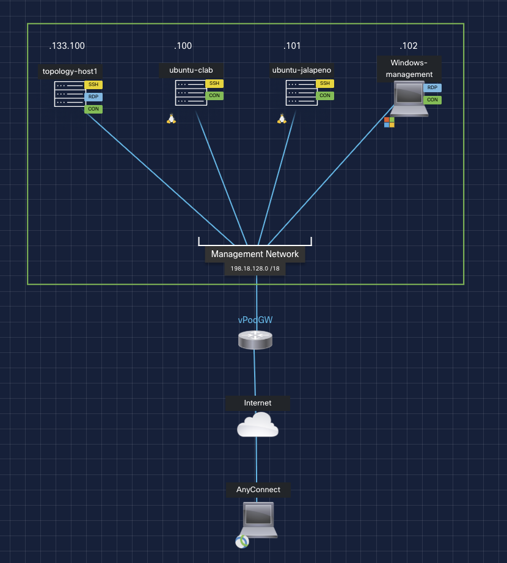

# Welcome to LTMSI-3000: Modern AI networks: IOS-XR, SRv6, Cilium, and SONiC

## Introduction: 

In this immersive hands-on lab, explore how next-generation AI networking fabrics can be designed and deployed using SRv6, Kubernetes-native networking with Cilium, and open-source data center technologies. You’ll explore a new way to architect, program, and optimize traffic in high-performance compute environments using Cisco IOS-XR and SONiC. This session walks participants through a series of progressive tutorials and labs covering: - SRv6 fundamentals and real-world use cases for L3VPN and Traffic Engineering - Kubernetes integration using Cilium and SRv6 for modern service-aware routing - SONiC-based data center fabric bring-up and host-based SRv6. - Programmatic traffic control using custom SRv6 mappings and intelligent automation Participants will gain practical skills in deploying flexible, scalable, and programmable infrastructure purpose-built for AI, HPC, or cloud-native workloads. Whether you’re a network engineer, cloud architect, or AI infrastructure specialist, this session bridges the gap between architecture and hands-on implementation.

| Task                                   | Status             | Notes                                    |
|----------------------------------------|--------------------|------------------------------------------|
| Create infrastructure (dCloud)         | ⏳ In Progress     | Setting up base topology on Containerlab |
| Install Docker - Containerlab          | ✅ Completed       | DONE                                     
| Install Container images               | ⏳ In Progress     | images being downloaded                  |
| Diagrams                               | 📌 To Do           | Network diagram finalized                |
| IP Addressing Plan                     | 📌 To Do           | Allocating subnets for lab devices       |
| Lab Info                               | 📌 To Do           | Documenting lab setup and requirements   |
| Backlog                                | 📌 To Do           | Collecting feature requests and tasks    |
| 

# dCloud lab Topology

The following diagram shows the high level architecture that will be used for this lab:

This lab environment provides a hands-on experience with modern, programmable network infrastructures using modular technologies: SONiC, XRd, Containerlab, Edgeshark, and Jalapeno.

To support this, we are using four virtual machines, each with a specific role. Here’s what each VM is responsible for:

##  ubuntu-clab — The Topology Orchestrator

IP Address: 198.18.128.100

This VM is the core of your lab environment. It hosts:
	•	Containerlab, which is used to define and deploy virtual topologies using SONiC and XRd.
	•	Edgeshark, which provides traffic capture and visualization inside Containerlab.
	•	XRd images (Cisco’s virtual routing platform).
	•	SONiC containers (open-source network OS).

📌 Use Case:
	•	You will launch and destroy network topologies from this VM.
	•	All container-based routers and switches (e.g., SONiC, XRd) run here.
	•	You may also use this VM for container debugging, packet capture, or log collection.

🧰 Key Tools:
	•	containerlab
	•	Docker
	•	Edgeshark
	•	Topology definition files (*.clab.yaml)

## ubuntu-jalapeno — The SDN Controller Plane

IP Address: 198.18.128.101

This VM runs Project Jalapeno, an SDN automation framework focused on building control planes for tunnel-based networking, such as:
	•	Data center overlays (VXLAN, EVPN)
	•	Traffic Engineering controllers
	•	SD-WAN logic

Jalapeno introduces a modular and graph-based data modeling platform that can:
	•	Ingest data from the lab topology (via streaming telemetry or config APIs)
	•	Build a topology model in a graph database
	•	Support path computation or automation apps

📌 Use Case:
	•	This VM collects state and topology data from your lab network
	•	It builds a real-time graph model of your infrastructure
	•	It can drive path computations, config pushes, or analytics workflows

🧰 Key Tools & Components (installed via shell scripts):
	•	ONOS (for control logic)
	•	Graph databases (like JanusGraph)
	•	REST/gRPC APIs

## Windows-management — The Student Interface

IP Address: 198.18.128.102

This is a Windows-based management VM used by each student to interact with the lab environment.

📌 Use Case:
	•	Students RDP into this VM as their main entry point.
	•	They use tools like:
	•	PuTTY / SSH / VS Code to access devices
	•	Wireshark GUI for packet captures

🧰 Key Tools Available to Students:
	•	RDP access
	•	Wireshark GUI
	•	Web browser (Chrome or Firefox)
	•	SSH client
	•	Visual Studio Code (optional: Remote SSH plugin)
