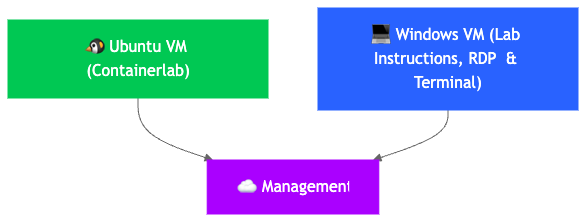

# TMSI-3000

Next-Gen AI Networking: SRv6 Programmability, Silicon One Architecture, and Intelligent Automation on IOS-XR

References used for this lab:

- https://github.com/jalapeno/SRv6_dCloud_Lab
- https://github.com/jalapeno/srv6-ai-backend

| Task                                   | Status             | Notes                                    |
|----------------------------------------|--------------------|------------------------------------------|
| Create infrastructure (dCloud)         | ⏳ In Progress     | Setting up base topology on Containerlab |
| Install Docker - Containerlab          | ✅ Completed       | DONE                                     
| Install Container images               | ⏳ In Progress     | images being downloaded                  |
| Diagrams                               | 📌 To Do           | Network diagram finalized                |
| IP Addressing Plan                     | 📌 To Do           | Allocating subnets for lab devices       |
| Lab Info                               | 📌 To Do           | Documenting lab setup and requirements   |
| Backlog                                | 📌 To Do           | Collecting feature requests and tasks    |
| 

### Legend:
✅ Completed  
⏳ In Progress  
📌 To Do  

# TMSI-3000

The following diagram shows the high level architecture that will be used for this lab:

