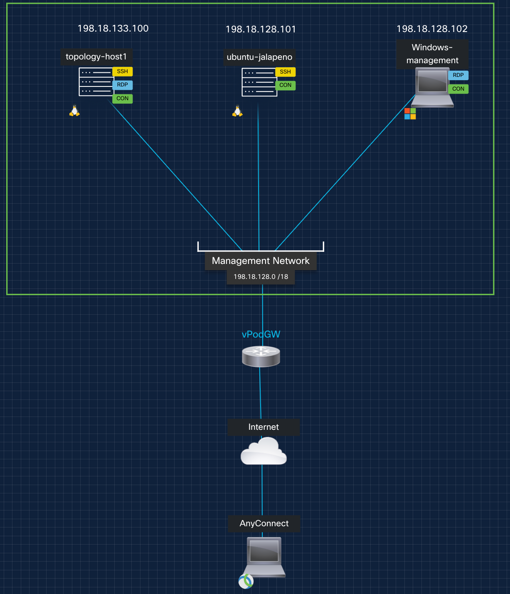

# Welcome to LTMSI-3000: Modern AI networks: IOS-XR, SRv6, Cilium, and SONiC

## Introduction: 

In this immersive hands-on lab, explore how next-generation AI networking fabrics can be designed and deployed using SRv6, Kubernetes-native networking with Cilium, and open-source data center technologies. You’ll explore a new way to architect, program, and optimize traffic in high-performance compute environments using Cisco IOS-XR and SONiC. This session walks participants through a series of progressive tutorials and labs covering: - SRv6 fundamentals and real-world use cases for L3VPN and Traffic Engineering - Kubernetes integration using Cilium and SRv6 for modern service-aware routing - SONiC-based data center fabric bring-up and host-based SRv6. - Programmatic traffic control using custom SRv6 mappings and intelligent automation Participants will gain practical skills in deploying flexible, scalable, and programmable infrastructure purpose-built for AI, HPC, or cloud-native workloads. Whether you’re a network engineer, cloud architect, or AI infrastructure specialist, this session bridges the gap between architecture and hands-on implementation.

## Contents
* Repository Overview [LINK](#github-repository-overview)
* Lab Topology [LINK](#dCloud-lab-Topology)
* Remote Access [LINK](#remote-access)
* Project Jalapeno [LINK](#jalapeno)
* Lab 1 - XRd Topology Setup and SRv6 L3VPN + SRv6 TE Configuration (LINK TO PROVIDE)
* Lab 2 - Kubernetes SRv6 with Cilium (LINK TO PROVIDE)
* Lab 3 - SONIC DC Fabric Bring Up (LINK TO PROVIDE)
* Lab 4 - Host Based SRv6 static routing with SONIC (LINK TO PROVIDE)

## Github Repository Overview
Each of the labs is designed to be completed in the order presented. Lab 1 will launch our XRd topology with baseline configurations. In each subsequent lab (2-5) we'll add SRv6 configurations and make use of our SRv6 network.

### Root Directory

| File Name      | Description                                                         |
|:---------------|:--------------------------------------------------------------------|
| ansible        | Ansible scripts to update the lab at bootup                         |
| topo_drawings  | Lab diagrams folder                                                 |
| util           | Utility scripts                                                     |
| lab_1 -> lab_5 | Individual lab folders                                              |

### Individual Lab Directories
Within each lab directory you should see several files of importance:
(X = lab #)

| File Name                | Description                                                  |
|:-------------------------|:-------------------------------------------------------------|
| cleanup-lab_X.sh         | Cleans up the containerlab topology and files                |
| lab_X-topology.yml       | YAML input file for containerlab to create the topology      |
| lab_X-guide.md           | User guide for this lab                                      |

We've recently launched a whole series of SRv6 labs on github, many of which are built on XRd:

https://github.com/segmentrouting/srv6-labs

# dCloud lab Topology

The following diagram shows the high level architecture that will be used for this lab:

This lab environment provides a hands-on experience with modern, programmable network infrastructures using modular technologies: SONiC, XRd, Containerlab, Edgeshark, and Jalapeno.

To support this, we are using four virtual machines, each with a specific role. Here’s what each VM is responsible for:

##  ubuntu-clab — The Topology Orchestrator

IP Address: 198.18.128.100

This VM is the core of your lab environment. It hosts:
	•	Containerlab, which is used to define and deploy virtual topologies using SONiC and XRd.
	•	Edgeshark, which provides traffic capture and visualization inside Containerlab.
	•	XRd images (Cisco’s virtual routing platform).
	•	SONiC containers (open-source network OS).

📌 Use Case:
	•	You will launch and destroy network topologies from this VM.
	•	All container-based routers and switches (e.g., SONiC, XRd) run here.
	•	You may also use this VM for container debugging, packet capture, or log collection.

🧰 Key Tools:
	•	containerlab
	•	Docker
	•	Edgeshark
	•	Topology definition files (*.clab.yaml)

## ubuntu-jalapeno — The SDN Controller Plane

IP Address: 198.18.128.101

This VM runs Project Jalapeno, an SDN automation framework focused on building control planes for tunnel-based networking, such as:
	•	Data center overlays (VXLAN, EVPN)
	•	Traffic Engineering controllers
	•	SD-WAN logic

Jalapeno introduces a modular and graph-based data modeling platform that can:
	•	Ingest data from the lab topology (via streaming telemetry or config APIs)
	•	Build a topology model in a graph database
	•	Support path computation or automation apps

📌 Use Case:
	•	This VM collects state and topology data from your lab network
	•	It builds a real-time graph model of your infrastructure
	•	It can drive path computations, config pushes, or analytics workflows

🧰 Key Tools & Components (installed via shell scripts):
	•	ONOS (for control logic)
	•	Graph databases (like JanusGraph)
	•	REST/gRPC APIs

## Windows-management — The Student Interface

IP Address: 198.18.128.102

This is a Windows-based management VM used by each student to interact with the lab environment.

📌 Use Case:
	•	Students RDP into this VM as their main entry point.
	•	They use tools like:
	•	PuTTY / SSH / VS Code to access devices
	•	Wireshark GUI for packet captures

🧰 Key Tools Available to Students:
	•	RDP access
	•	Wireshark GUI
	•	Web browser (Chrome or Firefox)
	•	SSH client
	•	Visual Studio Code (optional: Remote SSH plugin)
