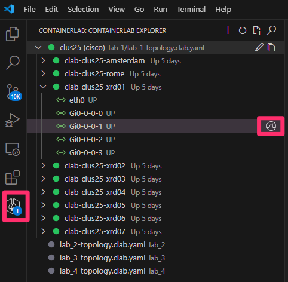

# Lab 1: SRv6 Control plane analysis with EdgeShark [5 Min]

### Description: 
This is a supplemental lab guide designed to help you visualize traffic using EdgeShark. This tool, embedded in the Containerlab Visual Studio Code extension, allows us to intercept and analyze IS-IS and BGP SRv6 control plane traffic.


## Contents
- [Lab 1: SRv6 Control plane analysis with edge shark \[5 Min\]](#lab-1-srv6-control-plane-analysis-with-edge-shark-5-min)
    - [Description:](#description)
  - [Contents](#contents)
  - [Lab Objectives](#lab-objectives)
  - [IS-IS Packet Analysis](#is-is-packet-analysis)
  - [End of Lab 1 - ISIS control plane and edgeshark](#end-of-lab-1---isis-control-plane-and-edgeshark)
  

## Lab Objectives
The student upon completion of the Lab 1 packet walk should have achieved the following objectives:

* Inspect IS-IS Level 2 LSPs using Wireshark (EdgeShark) to validate control-plane advertisement of SRv6.
* Apply Wireshark display filters to isolate specific LSPs by LSP-ID.
* Identify and interpret key IS-IS TLV, including:
  * Area Address (TLV 1)
  * Router ID (TLV 134)
  * IPv4/IPv6 Interface Addresses (TLV 132/232)
  * Extended IS Reachability (TLV 22)
  * Extended IP Reachability (TLV 135)


## IS-IS Packet Analysis

To launch EdgeShark and inspect traffic, simply click on the interface you want to capture packets from in the Containerlab tab within Visual Studio Code. In this case, we want to capture traffic on interface Gi0/0/0/0 of *XRD1*.



Clicking on the interface will automatically launch wireshark and starts the capture.

Apply a filter in the wireshark filter tab and we will be able to inspect the different ISIS TLV to validate our segment routing configuration.

```
Wireshark Filter: "isis.lsp.lsp_id == 0000.0000.0001.00-00"
```


General IS-IS Information

- LSP-ID: 0000.0000.0001.00-00 :
  - Originating router System ID 0000.0000.0001, pseudonode 00, fragment 00.
- IS Type: Level 2 (3):
  - Operates as an IS-IS Level 2 Intermediate System.


IS-IS TLVs:

- Area Address (t=1): Defines IS-IS area (e.g., 49.0001)

- Router ID (t=134): The IGP router identifier (e.g., 10.0.0.1) 

- IPv4 Interface Address (t=132): IPv4 address used for routing; e.g., 10.0.0.1.

- IPv6 Interface Address (t=232): E.g., fc00:0:1111::1, used to reach the node via IPv6

- IS Type: Level 2 Intermediate System (IS type 3) — this router participates in inter-area routing.

- Extended IS Reachability (t=22): Lists neighboring IS-IS nodes:
  - 0000.0000.0002.00
  - 0000.0000.0005.00

Multi-Topology IS Reachability (t=222): Advertises neighbor reachability in topology ID 2 (IPv6):
  - Same neighbors as above under an SRv6-aware topology.


Extended IP Reachability (t=135): Lists IPv4 prefixes reachable through this router:
  - 10.0.0.1/32
  - 10.1.1.0/31


SRv6 capabilities and Locator:

SRv6 Capability (t=25): Indicates the router supports Segment Routing over IPv6 (SRv6).

SR Algorithms (t=19): Indicates which path computation algorithms are supported:
  - Algorithm 0 → Shortest Path First (SPF)
  - Algorithm 1 → Strict SPF

Node Maximum SID Depth (t=23): Specifies the maximum number of SIDs the node can push — here it’s 10.

SRv6 Locator (t=27): Most critical TLV for SRv6 control-plane:
  - Prefix: fc00:0:1111::/48
  - Algorithm: 0 (SPF)
  - Metric: 1 (cost to reach)
  - Sub-TLVs:
  - Prefix Attribute Flags (t=4): Flags not set (default behavior)
  - End SID (t=5): fc00:0:1111:: → This is a Node SID (uN), meaning it represents the node itself and terminates the SRv6 path.


This IS-IS LSP confirms that:
  - The router identified as xrd01 advertises both IPv4 and IPv6 reachability.
  - It supports SRv6, advertising a locator (fc00:0:1111::/48) and a Node SID (fc00:0:1111::) using TLV 27.
  - The node can push 10 SIDs, and supports Shortest Path First as well as Strict SPF algorithms.
  - The router connects to other IS-IS nodes: 0000.0000.0002.00 and 0000.0000.0005.00.
  - It advertises IPv4 prefixes (10.0.0.1/32, 10.1.1.0/31) and is reachable via IPv6 at fc00:0:1111::1.

This LSP forms the foundation of the SRv6 control plane, enabling the steering of packets based on advertised SIDs in the data plane.


## End of Lab 1 - ISIS control plane and edgeshark

Lab 1 is completed, please proceed to [Lab 2](https://github.com/cisco-asp-web/LTRMSI-3000/blob/main/lab_2/lab_2-guide.md)
