# Lab 1 Guide: Deploy XRd Topology and apply SRv6 configurations [20 Min]

The Cisco Live LTRMSI-3000 lab makes heavy use of containerlab to orchestrate our dockerized IOS-XR router known as XRd. If you wish to explore XRd and its uses beyond the scope of this lab the xrdocs team has posted a number of tutorials here: 

https://xrdocs.io/virtual-routing/tags/#xrd-tutorial-series

For more information on containerlab see:

https://containerlab.dev/


## Contents
- [Lab 1 Guide: Deploy XRd Topology and apply SRv6 configurations \[20 Min\]](#lab-1-guide-deploy-xrd-topology-and-apply-srv6-configurations-20-min)
  - [Contents](#contents)
  - [Lab Objectives](#lab-objectives)
  - [Topology](#topology)
  - [Accessing the routers](#accessing-the-routers)
  - [Launch and Validate XRD Topology](#launch-and-validate-xrd-topology)
    - [Connect to the Topology Host and SSH to Containers.](#connect-to-the-topology-host-and-ssh-to-containers)
  - [Validate Attached Linux VMs and Containers](#validate-attached-linux-vms-and-containers)
    - [Berlin VM](#berlin-vm)
  - [Validate ISIS Topology](#validate-isis-topology)
    - [Add Synthetic Latency to the Links](#add-synthetic-latency-to-the-links)
  - [Validate BGP Peering](#validate-bgp-peering)
  - [Configure and Validate SRv6](#configure-and-validate-srv6)
    - [Configure SRv6 on xrd01](#configure-srv6-on-xrd01)
    - [Configure SRv6 on xrd07](#configure-srv6-on-xrd07)
    - [Validate SRv6 configuration and reachability](#validate-srv6-configuration-and-reachability)
  - [End-to-End Connectivity - Edgeshark](#end-to-end-connectivity---edgeshark)
    - [IS-IS Packet Analysis](#is-is-packet-analysis)
    - [End of Lab 1](#end-of-lab-1)
  
## Lab Objectives
We will have achieved the following objectives upon completion of Lab 1:

* Access all devices in the lab
* Deployed the XRd network topology
* Basic familiarity with containerlab
* Confirm IPv4 and IPv6 connectivity
* Familiarity with base SRv6 configuration 


## Topology 

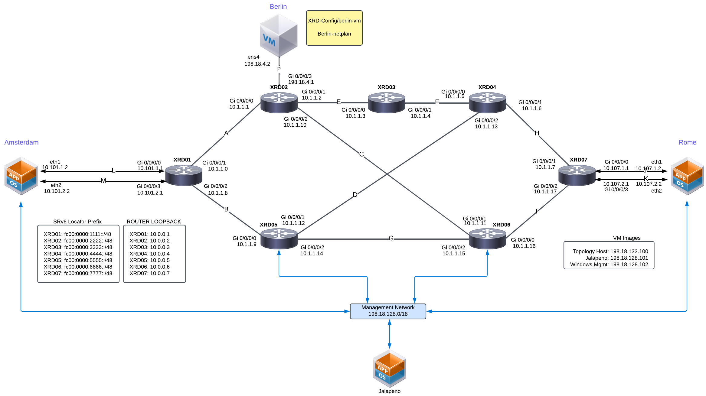

## Accessing the routers 

⚠️⚠️⚠️  Note: This section is provided for reference only. We will walk through router access during the live demo.

Lab attendees can interact with the routers in multiple ways. They may choose to use the **topology host** VM as a jumpbox to:

- Launch topologies  
- SSH into routers  
- Perform additional configuration tasks

However, it is **recommended** to use **Visual Studio Code** on the provided **Windows virtual machine** for a more streamlined experience.

This environment comes pre-configured with useful extensions such as:

- **Remote-SSH**
- **Containerlab**

These tools allow attendees to:

- Start and manage topologies  
- SSH into routers  
- Access containers  
- Capture traffic easily using **Edgeshark**

This setup simplifies lab operations and significantly enhances usability.

RDP to the Windows Virtual machine from the lab attendee laptop:

The lab can be accessed using a Remote Desktop connection to the windows management hosts at 198.18.128.102 (admin / C1sco12345)

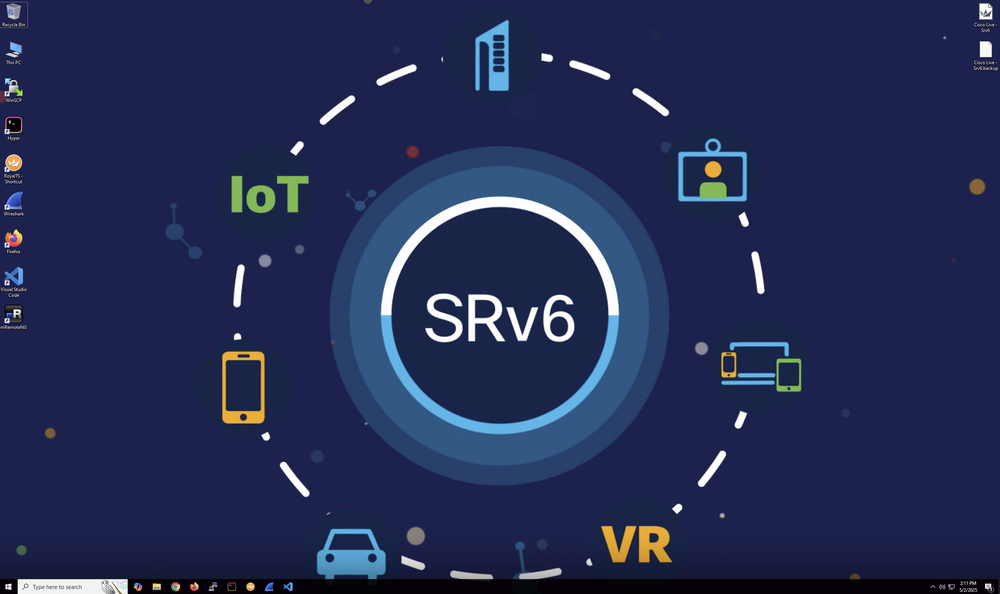


Launch Visual Code:

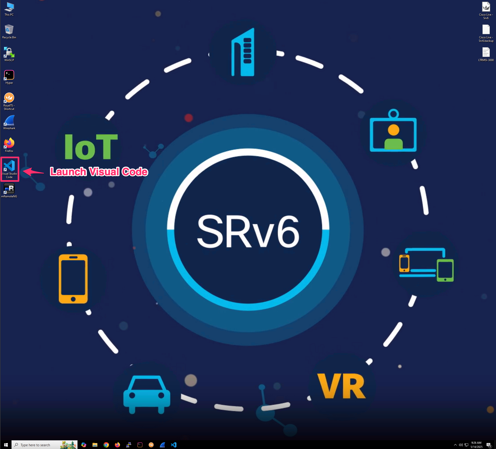

visual code will connect to the topology host and lab attendees should enter the "cisco123" password 

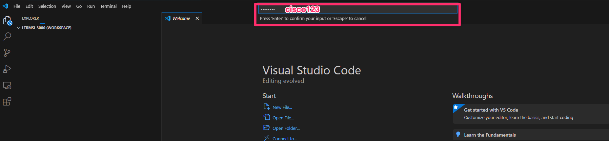

you are now connected to the topology host and can start topologies and inspect traffic.

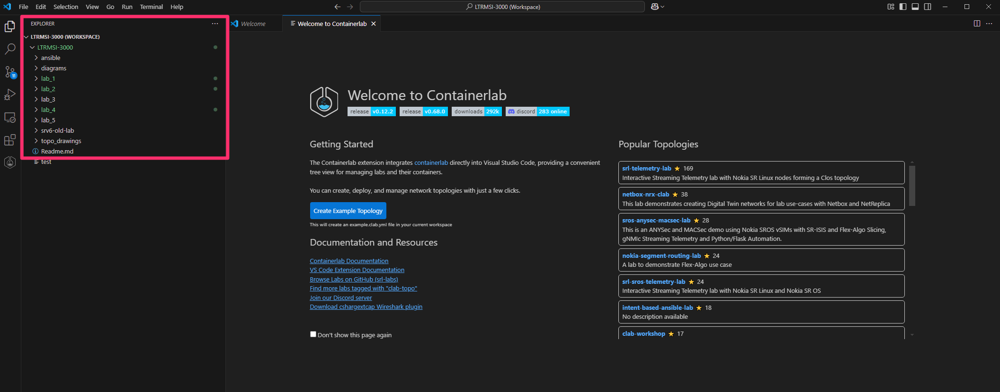


**User Credentials**
All VMs, routers, etc. use the same user credentials:
```
User: cisco, Password: cisco123
```


## Launch and Validate XRD Topology

The containerlab visual code extension will be used to launch lab 1:

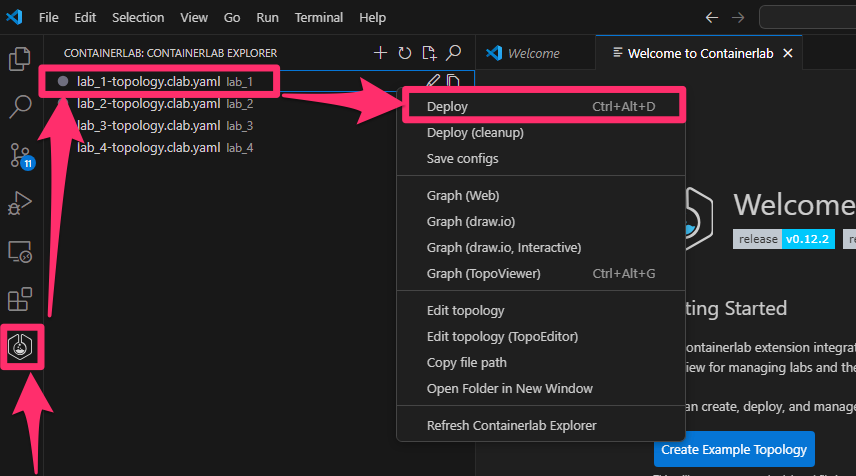

The icons should turn green to visually indicate that the topology has been successfully deployed in Containerlab.

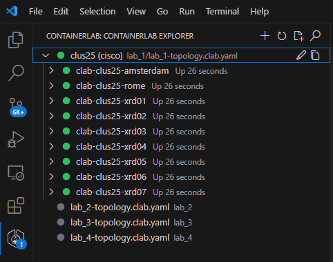

We can also verify the containerlab logs in the visual code output window. Truncated example:

```
[DEBUG] Containerlab extension activated.
[INFO] Checking "which containerlab" to verify installation...
[INFO] containerlab is already installed.
[INFO] Running "containerlab version check".
[INFO] User is in "clab_admins". Running without sudo: containerlab version check
🎉 A newer containerlab version (0.68.0) is available!
Release notes: https://containerlab.dev/rn/0.68/
Run 'sudo clab version upgrade' or see https://containerlab.dev/install/ for installation options.

[containerlab] Running: containerlab deploy -r docker -t /home/cisco/LTRMSI-3000/lab_1/lab_1-topology.clab.yaml
[stderr] 16:41:26 INFO Containerlab started version=0.67.0
[stderr] 16:41:26 INFO Parsing & checking topology file=lab_1-topology.clab.yaml
[stderr] 16:41:26 INFO Creating docker network name=mgt-network IPv4 subnet=10.254.254.0/24 IPv6 subnet="" MTU=0
[stderr] 16:41:26 INFO Creating lab directory path=/home/cisco/LTRMSI-3000/lab_1/clab-clus25
[stderr] 16:41:26 INFO Creating container name=amsterdam
[stderr] 16:41:26 INFO Creating container name=rome
[stderr] 16:41:26 INFO Creating container name=xrd03
[stderr] 16:41:26 INFO Creating container name=xrd02
<snip>
[stderr] 16:41:28 INFO Running postdeploy actions for Cisco XRd 'xrd06' node
[stderr] 16:41:28 INFO Created link: xrd01:Gi0-0-0-3 ▪┄┄▪ amsterdam:eth2
[stderr] 16:41:28 INFO Created link: xrd07:Gi0-0-0-3 ▪┄┄▪ rome:eth2
[stderr] 16:41:28 INFO Adding host entries path=/etc/hosts
[stderr] 16:41:28 INFO Adding SSH config for nodes path=/etc/ssh/ssh_config.d/clab-clus25.conf

╭───────────────────────┬────────────────────────────────┬─────────┬────────────────╮
│          Name         │           Kind/Image           │  State  │ IPv4/6 Address │
├───────────────────────┼────────────────────────────────┼─────────┼────────────────┤
│ clab-clus25-amsterdam │ linux                          │ running │ 10.254.254.108 │
│                       │ amsterdam:latest               │         │ N/A            │
├───────────────────────┼────────────────────────────────┼─────────┼────────────────┤
│ clab-clus25-rome      │ linux                          │ running │ 10.254.254.109 │
│                       │ rome:latest                    │         │ N/A            │
├───────────────────────┼────────────────────────────────┼─────────┼────────────────┤
│ clab-clus25-xrd01     │ cisco_xrd                      │ running │ 10.254.254.101 │
│                       │ cisco-xrd-control-plane:24.4.1 │         │ N/A            │
├───────────────────────┼────────────────────────────────┼─────────┼────────────────┤
│ clab-clus25-xrd02     │ cisco_xrd                      │ running │ 10.254.254.102 │
│                       │ cisco-xrd-control-plane:24.4.1 │         │ N/A            │
├───────────────────────┼────────────────────────────────┼─────────┼────────────────┤
│ clab-clus25-xrd03     │ cisco_xrd                      │ running │ 10.254.254.103 │
│                       │ cisco-xrd-control-plane:24.4.1 │         │ N/A            │
├───────────────────────┼────────────────────────────────┼─────────┼────────────────┤
│ clab-clus25-xrd04     │ cisco_xrd                      │ running │ 10.254.254.104 │
│                       │ cisco-xrd-control-plane:24.4.1 │         │ N/A            │
├───────────────────────┼────────────────────────────────┼─────────┼────────────────┤
│ clab-clus25-xrd05     │ cisco_xrd                      │ running │ 10.254.254.105 │
│                       │ cisco-xrd-control-plane:24.4.1 │         │ N/A            │
├───────────────────────┼────────────────────────────────┼─────────┼────────────────┤
│ clab-clus25-xrd06     │ cisco_xrd                      │ running │ 10.254.254.106 │
│                       │ cisco-xrd-control-plane:24.4.1 │         │ N/A            │
├───────────────────────┼────────────────────────────────┼─────────┼────────────────┤
│ clab-clus25-xrd07     │ cisco_xrd                      │ running │ 10.254.254.107 │
│                       │ cisco-xrd-control-plane:24.4.1 │         │ N/A            │
╰───────────────────────┴────────────────────────────────┴─────────┴────────────────╯
```

> [!NOTE]
> All *containerlab* commands can be abbreviated to *clab*. Example: *sudo clab deploy -t lab_1-topology.clab.yaml*
If the terminal is not visible in VScode, please launch a new terminal using the terminal / New terminal tabs. that way, you will be directly connected to the topology host using SSH.


### Connect to the Topology Host and SSH to Containers.

The entire lab is doable from visual code, you should launch a terminal and it will automatically ssh into the topology host.

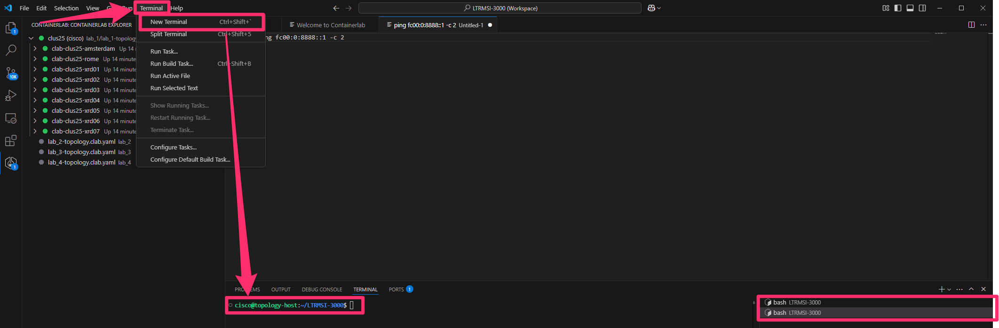

```
docker ps -a
sudo containerlab inspect --all
```

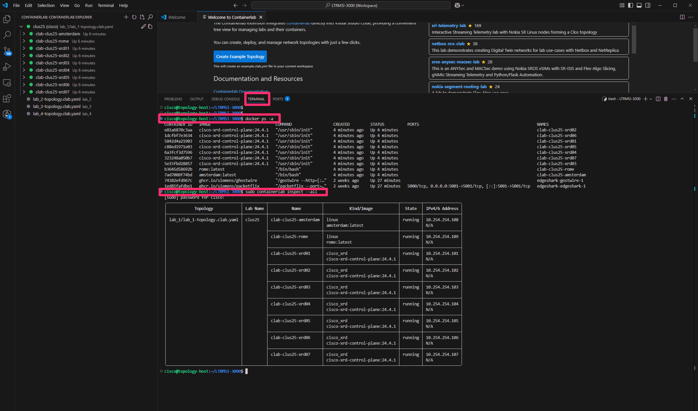


> [!IMPORTANT]
> The XRd router instances should be available for SSH access about 2 minutes after spin up.


To SSH into a router, you can use the containerlab visual code extension

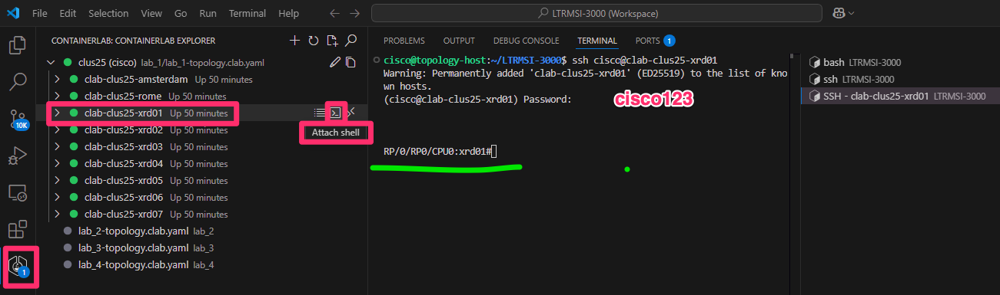


## Validate Attached Linux VMs and Containers

### Berlin VM

In our lab the **Berlin VM** is an Ubuntu Kubernetes node running the **Cilium** Container Network Interface (CNI) and connected to the **xrd02** router. 


1. SSH to *Berlin VM* from the *topology-host VM* (using the visual code terminal output)
   ```
   ssh cisco@berlin
   ```
   or
   ```
   ssh cisco@192.168.122.100
   ```

2. Check IPv6 connectivity from **Berlin** to **xrd02**
    ```
    ping fc00:0:8888::1 -c 2
    ```
    ```
    cisco@berlin:~$ ping fc00:0:8888::1 -c 2
    PING fc00:0:8888::1 (fc00:0:8888::1) 56 data bytes
    64 bytes from fc00:0:8888::1: icmp_seq=1 ttl=64 time=1.28 ms
    64 bytes from fc00:0:8888::1: icmp_seq=2 ttl=64 time=1.20 ms

    --- fc00:0:8888::1 ping statistics ---
    2 packets transmitted, 2 received, 0% packet loss, time 1001ms
    rtt min/avg/max/mdev = 1.203/1.242/1.282/0.039 ms
    ```

    Visual representation:

    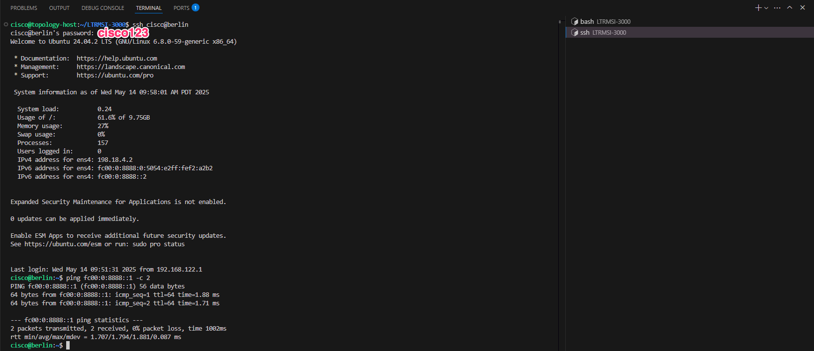

    You can now exit the Berlin VM and return to the SSH session on the topology host (still in visual code)


## Validate ISIS Topology

Our topology is running ISIS as its underlying IGP with basic settings pre-configured at startup in lab 1.

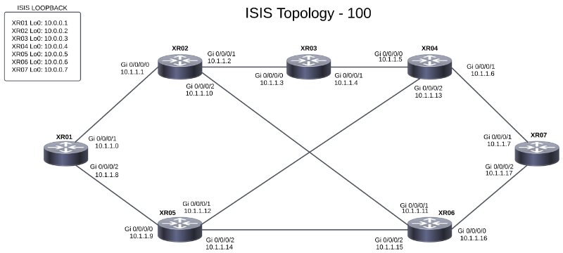

For full size image see [LINK](../topo_drawings/isis-topology-large.png)


1. SSH into any router and verify that ISIS is up and running and all seven nodes are accounted for in the topology database


    ```
    show isis topology
    ```
    or 
    ```
    show isis database
    ```
    ```
    RP/0/RP0/CPU0:xrd01#show isis topology 
    Fri May  9 03:11:23.663 UTC

    IS-IS 100 paths to IPv4 Unicast (Level-1) routers
    System Id          Metric    Next-Hop           Interface       SNPA          
    xrd01              --      

    IS-IS 100 paths to IPv4 Unicast (Level-2) routers
    System Id          Metric    Next-Hop           Interface       SNPA          
    xrd01              --      
    xrd02              1         xrd02              Gi0/0/0/1       *PtoP*        
    xrd03              2         xrd02              Gi0/0/0/1       *PtoP*        
    xrd04              2         xrd05              Gi0/0/0/2       *PtoP*        
    xrd05              1         xrd05              Gi0/0/0/2       *PtoP*        
    xrd06              2         xrd05              Gi0/0/0/2       *PtoP*        
    xrd06              2         xrd02              Gi0/0/0/1       *PtoP*        
    xrd07              3         xrd05              Gi0/0/0/2       *PtoP*        
    xrd07              3         xrd02              Gi0/0/0/1       *PtoP* 
    ```

2. On **xrd01** validate end-to-end ISIS reachability by pinging **xrd07**:
   ```
   ping 10.0.0.7 source lo0
   ping fc00:0000:7777::1 source lo0
   ```

### Add Synthetic Latency to the Links

> [!NOTE]
> Normally pinging xrd-to-xrd in this dockerized environment would result in ping times of ~1-3ms. However, we wanted to simulate something a little more real-world so we built a shell script to add synthetic latency to the underlying Linux links. The script uses the [netem](https://wiki.linuxfoundation.org/networking/netem) 'tc' (traffic control) command line tool and executes commands in the XRds' underlying network namespaces. After running the script you'll see a ping RTT of anywhere from ~10ms to ~150ms. This synthetic latency will allow us to really see the effect of later traffic steering execises.

1. Optional: ping from **xrd01** to **xrd02** to see latency prior to applying the *add-latency.sh* script
   ```
   ping 10.1.1.1
   ```

   Example output:
   ```
   RP/0/RP0/CPU0:xrd01#ping 10.1.1.1
   Sending 5, 100-byte ICMP Echos to 10.1.1.1 timeout is 2 seconds:
   !!!!!
   Success rate is 100 percent (5/5), round-trip min/avg/max = 1/2/4 ms
   ```
   
2. Run the `add-latency.sh` script from the topology-host:
   ```
   cisco@topology-host:~/LTRMSI-3000$    ~/LTRMSI-3000/lab_1/scripts/add-latency.sh
   ```
   
   Example partial output:
   ```
    Latencies added. The following output applies in both directions, Ex: xrd01 -> xrd02 and xrd02 -> xrd01
    xrd01 link latency: 
    qdisc netem 800a: dev Gi0-0-0-1 root refcnt 13 limit 1000 delay 10.0ms
    qdisc netem 800b: dev Gi0-0-0-2 root refcnt 13 limit 1000 delay 5.0ms
   ```

3. Ping from router **xrd01** to **xrd02** and note the latency time.
   ```
   ping 10.1.1.1
   ```

   Example:
   ```
   RP/0/RP0/CPU0:xrd01#ping 10.1.1.1
   Sending 5, 100-byte ICMP Echos to 10.1.1.1 timeout is 2 seconds:
   !!!!!
   Success rate is 100 percent (5/5), round-trip min/avg/max = 12/12/16 ms
   ```
   

Script explanation - the script runs a *tc qdisc* command for each link in the topology. Example: 

```
sudo ip netns exec clab-clus25-xrd01 tc qdisc add dev Gi0-0-0-1 root netem delay 10000
```

- ip netns exec: runs a command inside the network namespace of the XRd container
- tc qdisc add ... netem delay <value>:
  - Adds a traffic control rule on the given interface
  - netem is used to emulate network conditions (in this case, delay)
  - Delay is in microseconds (e.g., 10000 = 10ms)


## Validate BGP Peering

In the topology we are running a single ASN 65000 with BGP running on **xrd01**, **xrd05**, **xrd06**, **xrd07**.  Routers **xrd05** and **xrd06** are functioning as route reflectors and **xrd01** and **xrd07** are clients. 

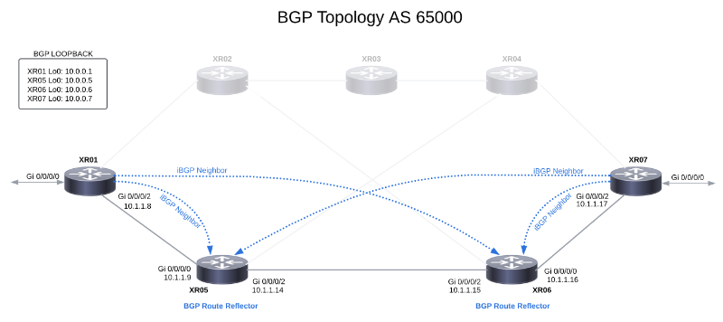

For full size image see [LINK](../topo_drawings/bgp-topology-large.png)

1. SSH into **xrd01** using the visual code extension and verify its neighbor state
    ```
    show ip bgp neighbors brief
    ```
    ```
    RP/0/RP0/CPU0:xrd01#show ip bgp neighbors brief

    Neighbor                Spk    AS Description                        Up/Down  NBRState
    10.0.0.5                0 65000 iBGP to xrd05 RR                     00:18:07 Established 
    10.0.0.6                0 65000 iBGP to xrd06 RR                     00:18:24 Established 
    fc00:0000:5555::1       0 65000 iBGPv6 to xrd05 RR                   00:22:02 Established 
    fc00:0000:6666::1       0 65000 iBGPv6 to xrd06 RR                   00:21:16 Established 
    ``` 

2. Verify that router **xrd01** is advertising the attached ipv6 network ```fc00:0:101:1::/64``` 
    ```
    show bgp ipv6 unicast advertised summary
    ```
    ```
    RP/0/RP0/CPU0:xrd01#show bgp ipv6 unicast advertised summary
    Tue Jan 10 21:40:56.812 UTC
    Network            Next Hop        From            Advertised to
    fc00:0:101:1::/64  fc00:0:1111::1  Local           fc00:0:5555::1
                                       Local           fc00:0:6666::1
    fc00:0:1111::1/128 fc00:0:1111::1  Local           fc00:0:5555::1
                                       Local           fc00:0:6666::1

    Processed 2 prefixes, 4 paths
    ```

3. Verify that router **xrd01** has received route ```fc00:0:107:1::/64``` from the route reflectors **xrd05** and **xrd07**. Look for ```Paths: (2 available)```
    ```
    show bgp ipv6 unicast fc00:0:107:1::/64
    ```
    ```
    RP/0/RP0/CPU0:xrd01#show bgp ipv6 unicast fc00:0:107:1::/64
    Tue Jan 10 21:47:51.153 UTC
    BGP routing table entry for fc00:0:107:1::/64
    Versions:
    Process           bRIB/RIB  SendTblVer
    Speaker                  17           17
    Last Modified: Jan 10 21:46:29.402 for 00:01:21
    Paths: (2 available, best #1)
    Not advertised to any peer
    Path #1: Received by speaker 0
    Not advertised to any peer
    Local
        fc00:0:7777::1 (metric 3) from fc00:0:5555::1 (10.0.0.7)              <------ origin from xrd07
        Origin IGP, metric 0, localpref 100, valid, internal, best, group-best
        Received Path ID 0, Local Path ID 1, version 17
        Originator: 10.0.0.7, Cluster list: 10.0.0.5                          <------ route reflector xrd05
    Path #2: Received by speaker 0
    Not advertised to any peer
    Local
        fc00:0:7777::1 (metric 3) from fc00:0:6666::1 (10.0.0.7)              <------ origin from xrd07
        Origin IGP, metric 0, localpref 100, valid, internal
        Received Path ID 0, Local Path ID 0, version 0
        Originator: 10.0.0.7, Cluster list: 10.0.0.6                          <------ route reflector xrd06
    ```

4. Verify that router xrd07 has received route ```fc00:0:101:1::/64``` from the route reflectors **xrd05** and **xrd07**. Look for ```Paths: (2 available)```
    ```
    show bgp ipv6 unicast fc00:0:101:1::/64
    ```
    ```
    RP/0/RP0/CPU0:xrd07#show bgp ipv6 unicast fc00:0:101:1::/64
    Tue Jan 10 21:48:45.627 UTC
    BGP routing table entry for fc00:0:101:1::/64
    Versions:
    Process           bRIB/RIB  SendTblVer
    Speaker                  18           18
    Last Modified: Jan 10 21:40:29.922 for 00:08:15
    Paths: (2 available, best #1)
    Not advertised to any peer
    Path #1: Received by speaker 0
    Not advertised to any peer
    Local
        fc00:0:1111::1 (metric 3) from fc00:0:5555::1 (10.0.0.1)              <------ origin from xrd01
        Origin IGP, metric 0, localpref 100, valid, internal, best, group-best
        Received Path ID 0, Local Path ID 1, version 18
        Originator: 10.0.0.1, Cluster list: 10.0.0.5                          <------ route reflector xrd05
    Path #2: Received by speaker 0
    Not advertised to any peer
    Local
        fc00:0:1111::1 (metric 3) from fc00:0:6666::1 (10.0.0.1)              <------ origin from xrd01
        Origin IGP, metric 0, localpref 100, valid, internal
        Received Path ID 0, Local Path ID 0, version 0
        Originator: 10.0.0.1, Cluster list: 10.0.0.6                          <------ route reflector xrd06
    ```

## Configure and Validate SRv6

SRv6 introduces the Network Programming framework that enables a network operator or an application to specify a packet processing program by encoding a sequence of instructions in the IPv6 packet header. Each instruction is implemented on one or several nodes in the network and identified by an SRv6 Segment Identifier (SID) in the packet. 

In SRv6, the IPv6 destination address represents a set of one or more instructions. In our lab we will use SRv6 "micro segment" (SRv6 uSID or just "uSID" for short) instead of the full SRH. SRv6 uSID is a straightforward extension of the SRv6 Network Programming model.

With SRv6 uSID:

 - The outer IPv6 destination address becomes the uSID carrier with the first 32-bits representing the uSID block, and the 6 remaining 16-bit chunks of the address become uSIDs or instructions
 - The existing ISIS and BGP Control Plane is leveraged without any change
 - The SRH can be used if our uSID instruction set extends beyond the 6 available in the outer IPv6 destination address
 - SRv6 uSID is based on the Compressed SRv6 Segment List Encoding in SRH [I-D.ietf-spring-srv6-srh-compression] framework

For reference one of the most recent IOS-XR Configuration guides for SR/SRv6 and ISIS can be found here: [LINK](https://www.cisco.com/c/en/us/td/docs/iosxr/cisco8000/segment-routing/24xx/configuration/guide/b-segment-routing-cg-cisco8000-24xx/configuring-segment-routing-over-ipv6-srv6-micro-sids.html)

SRv6 uSID locator and source address information for nodes in the lab:

| Router Name | Loopback Int|    Locator Prefix    |  Source-address     |                                           
|:------------|:-----------:|:--------------------:|:--------------------:|                          
| xrd01       | loopback 0  | fc00:0000:1111::/48  | fc00:0000:1111::1    |
| xrd02       | loopback 0  | fc00:0000:2222::/48  | fc00:0000:2222::1    |
| xrd03       | loopback 0  | fc00:0000:3333::/48  | fc00:0000:3333::1    |
| xrd04       | loopback 0  | fc00:0000:4444::/48  | fc00:0000:4444::1    |
| xrd05       | loopback 0  | fc00:0000:5555::/48  | fc00:0000:5555::1    |
| xrd06       | loopback 0  | fc00:0000:6666::/48  | fc00:0000:6666::1    |
| xrd07       | loopback 0  | fc00:0000:7777::/48  | fc00:0000:7777::1    |


> [!NOTE]
> We've preconfigured SRv6 on **xrd02** thru **xrd06**, so you'll only need to configure **xrd01** and **xrd07**

### Configure SRv6 on xrd01
1. Using the Visual Code extension, SSH to **xrd01** and enable SRv6 globally and define SRv6 locator and source address for outbound encapsulation 


    ```
    conf t

    segment-routing
      srv6
        encapsulation
          source-address fc00:0000:1111::1
        locators
          locator MyLocator
            micro-segment behavior unode psp-usd
            prefix fc00:0000:1111::/48
       commit
    ```

2. Enable SRv6 for ISIS  
    ```
    router isis 100
      address-family ipv6 unicast
         segment-routing srv6
           locator MyLocator
       commit
    ```

3. Enable SRv6 for BGP 
    ```
    router bgp 65000
    address-family ipv4 unicast
      segment-routing srv6
      locator MyLocator
      !
    ! 
    address-family ipv6 unicast
      segment-routing srv6
      locator MyLocator
      !
    !
    neighbor-group xrd-ipv4-peer
      address-family ipv4 unicast
      !
    ! 
    neighbor-group xrd-ipv6-peer
      address-family ipv6 unicast
      !
    !
    commit
    ```

### Configure SRv6 on xrd07


1. Using the Visual Code extension ssh to **xrd07** and apply the below config in a single shot:

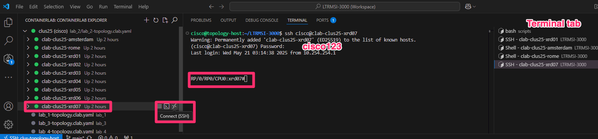


```
    conf t

    router isis 100
     address-family ipv6 unicast
     segment-routing srv6
     locator MyLocator
     !
    !
    router bgp 65000
     address-family ipv4 unicast
     segment-routing srv6
     locator MyLocator
     !
    ! 
    address-family ipv6 unicast
     segment-routing srv6
     locator MyLocator
     !
    !
    neighbor-group xrd-ipv4-peer
     address-family ipv4 unicast
     !
    ! 
    neighbor-group xrd-ipv6-peer
     address-family ipv6 unicast
     !
    !
    segment-routing
     srv6
     encapsulation
     source-address fc00:0000:7777::1
    !
     locators
      locator MyLocator
       micro-segment behavior unode psp-usd
       prefix fc00:0000:7777::/48
      !
    !
    commit
```

### Validate SRv6 configuration and reachability

1. Validation commands
    ```
    show segment-routing srv6 sid
    ```
    ```diff
    RP/0/RP0/CPU0:xrd01#show segment-routing srv6 sid
    Fri Dec 15 22:37:40.028 UTC

    *** Locator: 'MyLocator' *** 

    SID                         Behavior          Context                           Owner               State  RW
    --------------------------  ----------------  --------------------------------  ------------------  -----  --
    fc00:0:1111::               uN (PSP/USD)      'default':4369                    sidmgr              InUse  Y 
    fc00:0:1111:e000::          uA (PSP/USD)      [Gi0/0/0/1, Link-Local]:0:P       isis-100            InUse  Y 
    fc00:0:1111:e001::          uA (PSP/USD)      [Gi0/0/0/1, Link-Local]:0         isis-100            InUse  Y 
    fc00:0:1111:e002::          uA (PSP/USD)      [Gi0/0/0/2, Link-Local]:0:P       isis-100            InUse  Y 
    fc00:0:1111:e003::          uA (PSP/USD)      [Gi0/0/0/2, Link-Local]:0         isis-100            InUse  Y 
    +fc00:0:1111:e004::         uDT4              'default'                         bgp-65000           InUse  Y 
    +fc00:0:1111:e005::         uDT6              'default'                         bgp-65000           InUse  Y
    ```
> [!NOTE]
> The bottom two entries. These SIDs belong to BGP and represent End.DT behaviors. Any packet arriving with either of these SIDs as the outer IPv6 destination address will be decapsulated and then an LPM lookup in the global/default routing table will be performed on the inner destination address. More on this later in the *`SRv6 Packet Walk`* section.

2. Validate the SRv6 prefix-SID configuration. As example for xrd01 look for *SID value: fc00:0000:1111::*
    ```
    show isis segment-routing srv6 locators detail 
    ```

    ```
    RP/0/RP0/CPU0:xrd01#show isis segment-routing srv6 locators detail 

    IS-IS 100 SRv6 Locators
    Name                  ID       Algo  Prefix                    Status
    ------                ----     ----  ------                    ------
    MyLocator             1        0     fc00:0000:1111::/48       Active
    Advertised Level: level-1-2   
    Level: level-1      Metric: 1        Administrative Tag: 0         
    Level: level-2-only Metric: 1        Administrative Tag: 0         
    SID behavior: uN (PSP/USD)
    SID value:    fc00:0000:1111::                      <------------ HERE
    Block Length: 32, Node Length: 16, Func Length: 0, Args Length: 80
    ```

## End-to-End Connectivity - Edgeshark


EdgeShark is a browser-based packet capture and analysis tool built into Containerlab. It integrates seamlessly with Docker containers and allows users to capture traffic directly from interfaces without requiring local tools like tcpdump or Wireshark. In our lab, EdgeShark is essential for inspecting SRv6 headers, including the outer IPv6 header with SRv6 uSIDs, directly from routers or container interfaces. It enables us to filter IPv6 traffic and visualize segment lists, encapsulation behavior, and forwarding decisions. This simplifies the debugging of network reachability issues, particularly in topologies using SRv6 policies. EdgeShark also lets us observe IS-IS or BGP update messages to verify the propagation of SRv6 SIDs and their associated behaviors. By capturing traffic on specific interfaces like Gi0/0/0/X, we can validate whether SRv6 policies are applied and enforced correctly in the data plane. It helps correlate control-plane routing decisions with real packet forwarding behavior. 

EdgeShark can be launched directly from Visual Studio Code via the Containerlab extension or through the command line, offering convenience and flexibility. Ultimately, it gives us a real-time, non-intrusive method to verify SRv6 service chaining, path steering, and overall lab connectivity.


To launch EdgeShark and inspect traffic, simply click on the interface you want to capture packets from in the Containerlab tab within Visual Studio Code. In this case, we want to capture traffic on interface Gi0/0/0/0 of *XRD1*.

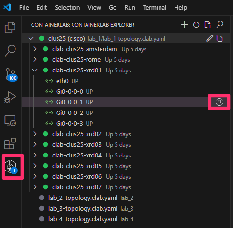

Clicking on the interface will automatically launch wireshark and starts the capture.


### IS-IS Packet Analysis

Apply a filter in the wireshark filter tab and we will be able to inspect the different ISIS TLV to validate our segment routing configuration.

```
Wireshark Filter: "isis.lsp.lsp_id == 0000.0000.0001.00-00"
```

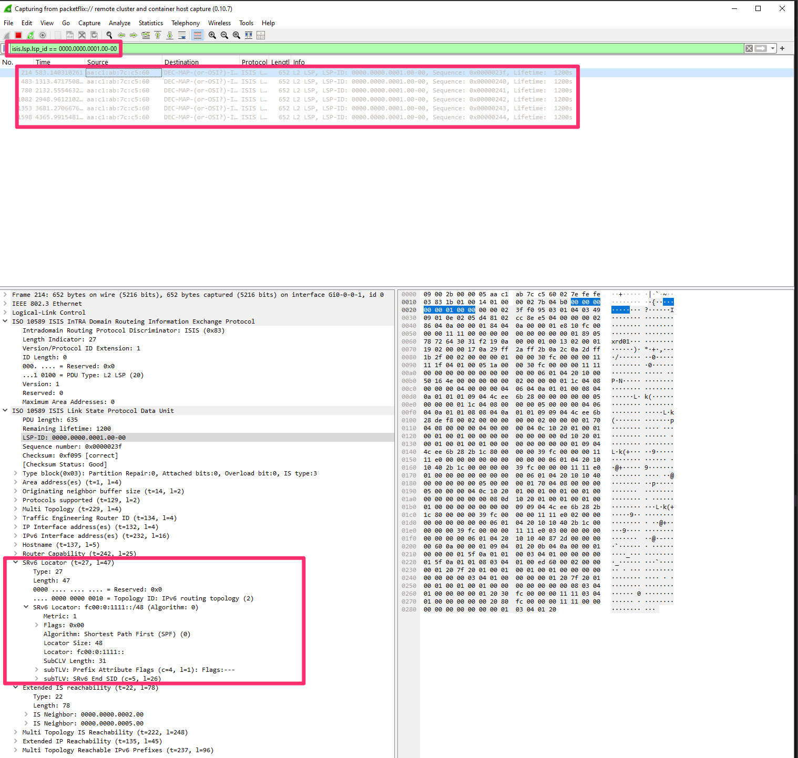


General IS-IS Information

- LSP-ID: 0000.0000.0001.00-00 :
  - Originating router System ID 0000.0000.0001, pseudonode 00, fragment 00.
- IS Type: Level 2 (3):
  - Operates as an IS-IS Level 2 Intermediate System.


IS-IS TLVs:

- Area Address (t=1): Defines IS-IS area (e.g., 49.0001)

- Router ID (t=134): The IGP router identifier (e.g., 10.0.0.1) 

- IPv4 Interface Address (t=132): IPv4 address used for routing; e.g., 10.0.0.1.

- IPv6 Interface Address (t=232): E.g., fc00:0:1111::1, used to reach the node via IPv6

- IS Type: Level 2 Intermediate System (IS type 3) — this router participates in inter-area routing.

- Extended IS Reachability (t=22): Lists neighboring IS-IS nodes:
  - 0000.0000.0002.00
  - 0000.0000.0005.00

Multi-Topology IS Reachability (t=222): Advertises neighbor reachability in topology ID 2 (IPv6):
  - Same neighbors as above under an SRv6-aware topology.


Extended IP Reachability (t=135): Lists IPv4 prefixes reachable through this router:
  - 10.0.0.1/32
  - 10.1.1.0/31


SRv6 capabilities and Locator:

SRv6 Capability (t=25): Indicates the router supports Segment Routing over IPv6 (SRv6).

SR Algorithms (t=19): Indicates which path computation algorithms are supported:
  - Algorithm 0 → Shortest Path First (SPF)
  - Algorithm 1 → Strict SPF

Node Maximum SID Depth (t=23): Specifies the maximum number of SIDs the node can push — here it’s 10.

SRv6 Locator (t=27): Most critical TLV for SRv6 control-plane:
  - Prefix: fc00:0:1111::/48
  - Algorithm: 0 (SPF)
  - Metric: 1 (cost to reach)
  - Sub-TLVs:
  - Prefix Attribute Flags (t=4): Flags not set (default behavior)
  - End SID (t=5): fc00:0:1111:: → This is a Node SID (uN), meaning it represents the node itself and terminates the SRv6 path.


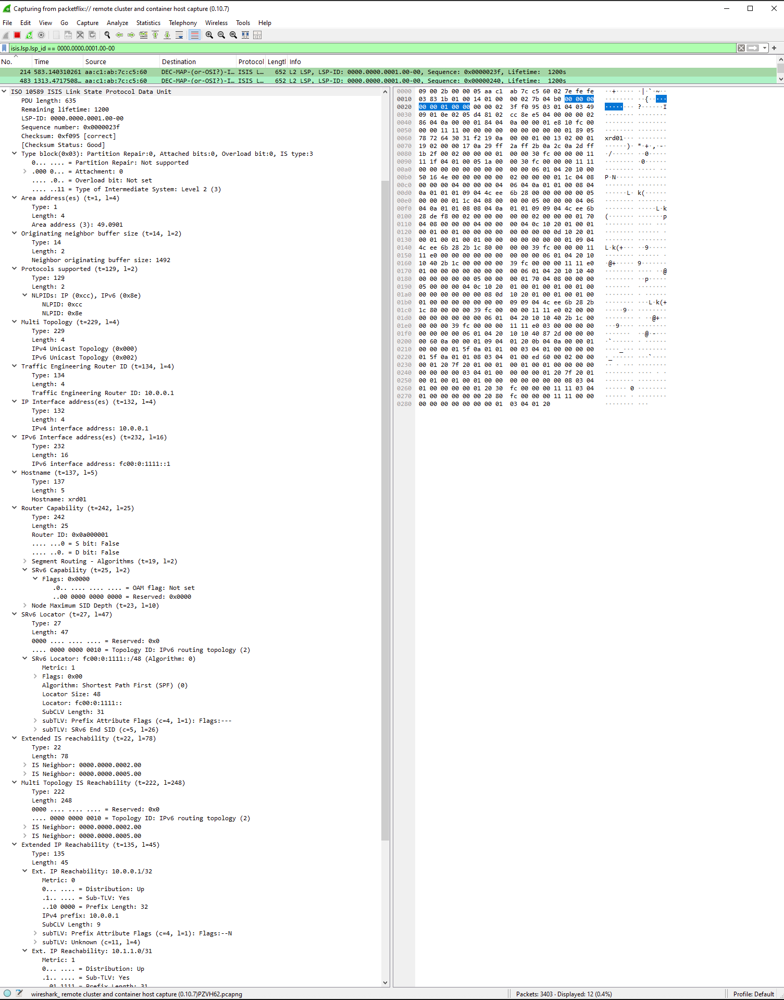

This IS-IS LSP confirms that:
  - The router identified as xrd01 advertises both IPv4 and IPv6 reachability.
  - It supports SRv6, advertising a locator (fc00:0:1111::/48) and a Node SID (fc00:0:1111::) using TLV 27.
  - The node can push 10 SIDs, and supports Shortest Path First as well as Strict SPF algorithms.
  - The router connects to other IS-IS nodes: 0000.0000.0002.00 and 0000.0000.0005.00.
  - It advertises IPv4 prefixes (10.0.0.1/32, 10.1.1.0/31) and is reachable via IPv6 at fc00:0:1111::1.

This LSP forms the foundation of the SRv6 control plane, enabling the steering of packets based on advertised SIDs in the data plane.


### End of Lab 1

Lab 1 is completed, you can either: 
  - Perform the optional [Lab 1 packet walk](https://github.com/cisco-asp-web/LTRMSI-3000/blob/main/lab_1/lab_1-packet-walk.md) or


Proceed to [Lab 2](https://github.com/cisco-asp-web/LTRMSI-3000/blob/main/lab_2/lab_2-guide.md)

test