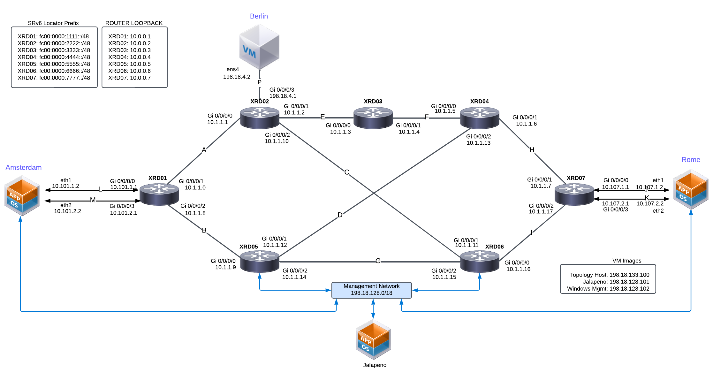
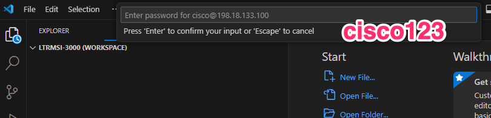
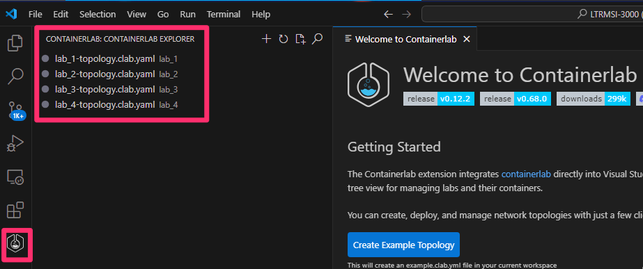

# Lab 1 Guide: Deploy XRd Topology and apply SRv6 configurations [20 Min]

The Cisco Live LTRMSI-3000 lab makes heavy use of containerlab to orchestrate our dockerized IOS-XR router known as XRd. If you wish to explore XRd and its uses beyond the scope of this lab the xrdocs team has posted a number of tutorials here: 

https://xrdocs.io/virtual-routing/tags/#xrd-tutorial-series

For more information on containerlab see:

https://containerlab.dev/

### Description: 
In Lab 1 we will launch the XRd topology apply base SRv6 configurations and validate things are working. 

## Contents
- [Lab 1 Guide: Deploy XRd Topology and apply SRv6 configurations \[20 Min\]](#lab-1-guide-deploy-xrd-topology-and-apply-srv6-configurations-20-min)
    - [Description:](#description)
  - [Contents](#contents)
  - [Lab Objectives](#lab-objectives)
  - [Topology](#topology)
  - [Accessing the routers](#accessing-the-routers)
    - [User Credentials](#user-credentials)
    - [Management Network Topology](#management-network-topology)
  - [Launch and Validate XRD Topology](#launch-and-validate-xrd-topology)
  - [Validate Attached Linux VMs and Containers](#validate-attached-linux-vms-and-containers)
    - [Berlin VM](#berlin-vm)
    - [Amsterdam and Rome Containers](#amsterdam-and-rome-containers)
  - [Validate ISIS Topology](#validate-isis-topology)
    - [Add Synthetic Latency to the Links](#add-synthetic-latency-to-the-links)
  - [Validate BGP Peering](#validate-bgp-peering)
  - [Configure and Validate SRv6](#configure-and-validate-srv6)
    - [SRv6 Configuration Steps](#srv6-configuration-steps)
      - [Configure SRv6 on xrd01](#configure-srv6-on-xrd01)
      - [Configure SRv6 on xrd07](#configure-srv6-on-xrd07)
      - [Validate SRv6 configuration and reachability](#validate-srv6-configuration-and-reachability)
  - [End-to-End Connectivity - Edgeshark](#end-to-end-connectivity---edgeshark)
    - [End of Lab 1](#end-of-lab-1)
  
## Lab Objectives
We will have achieved the following objectives upon completion of Lab 1:

* Access all devices in the lab
* Deployed the XRd network topology
* Basic familiarity with containerlab
* Confirm IPv4 and IPv6 connectivity
* Confirm SRv6 Locators   


## Topology 



## Accessing the routers

Lab attendees can interact with the routers in multiple ways. They may choose to use the **topology host** directly to:

- Launch topologies  
- SSH into routers  
- Perform additional configuration tasks

However, it is **recommended** to use **Visual Studio Code** on the provided **Windows virtual machine** for a more streamlined experience.

This environment comes pre-configured with useful extensions such as:

- **Remote-SSH**
- **Containerlab**

These tools allow attendees to:

- Start and manage topologies  
- SSH into routers  
- Access containers  
- Capture traffic easily using **Edgeshark**

This setup simplifies lab operations and significantly enhances usability.

RDP to the Windows Virtual machine from the lab attendee laptop:

The lab can be accessed using a Remote Desktop connection to the windows management hosts at 198.18.128.102 (admin / C1sco12345)


Launch Visual Code:


visual code will connect to the topology host and lab attendees should enter the "cisco123" password 



you are now connected to the topology host and can start topologies and inspect traffic.




### User Credentials
All VMs, routers, etc. use the same user credentials:
```
User: cisco, Password: cisco123
```

### Management Network Topology


For full size image see [LINK](/topo_drawings/management-network.png)

## Launch and Validate XRD Topology
1. SSH to the **Topology-Host VM** where we will launch the XRd routers
    ```
    ssh cisco@198.18.133.100
    ```

2. Change to the *lab_1* directory in the Git repository *`~/LTRMSI-3000/lab_1`*
   
    ```
    cd ~/LTRMSI-3000/lab_1
    ```

3.  Run the *containerlab deploy* command to launch the topology. Running the deploy command from this directory will launch the network into the "beginning of lab 1" configuration state 
   
    ``` 
    sudo containerlab deploy -t lab_1-topology.clab.yaml
    ```

    - Look for the below output from the end of the script confirming XRd instances 1-7 were created
    ```
    ╭───────────────────────┬────────────────────────────────┬─────────┬────────────────╮
    │          Name         │           Kind/Image           │  State  │ IPv4/6 Address │
    ├───────────────────────┼────────────────────────────────┼─────────┼────────────────┤
    │ clab-clus25-amsterdam │ linux                          │ running │ 10.254.254.108 │
    │                       │ amsterdam:latest               │         │ N/A            │
    ├───────────────────────┼────────────────────────────────┼─────────┼────────────────┤
    │ clab-clus25-rome      │ linux                          │ running │ 10.254.254.109 │
    │                       │ rome:latest                    │         │ N/A            │
    ├───────────────────────┼────────────────────────────────┼─────────┼────────────────┤
    │ clab-clus25-xrd01     │ cisco_xrd                      │ running │ 10.254.254.101 │
    │                       │ cisco-xrd-control-plane:24.4.1 │         │ N/A            │
    ├───────────────────────┼────────────────────────────────┼─────────┼────────────────┤
    │ clab-clus25-xrd02     │ cisco_xrd                      │ running │ 10.254.254.102 │
    │                       │ cisco-xrd-control-plane:24.4.1 │         │ N/A            │
    ├───────────────────────┼────────────────────────────────┼─────────┼────────────────┤
    │ clab-clus25-xrd03     │ cisco_xrd                      │ running │ 10.254.254.103 │
    │                       │ cisco-xrd-control-plane:24.4.1 │         │ N/A            │
    ├───────────────────────┼────────────────────────────────┼─────────┼────────────────┤
    │ clab-clus25-xrd04     │ cisco_xrd                      │ running │ 10.254.254.104 │
    │                       │ cisco-xrd-control-plane:24.4.1 │         │ N/A            │
    ├───────────────────────┼────────────────────────────────┼─────────┼────────────────┤
    │ clab-clus25-xrd05     │ cisco_xrd                      │ running │ 10.254.254.105 │
    │                       │ cisco-xrd-control-plane:24.4.1 │         │ N/A            │
    ├───────────────────────┼────────────────────────────────┼─────────┼────────────────┤
    │ clab-clus25-xrd06     │ cisco_xrd                      │ running │ 10.254.254.106 │
    │                       │ cisco-xrd-control-plane:24.4.1 │         │ N/A            │
    ├───────────────────────┼────────────────────────────────┼─────────┼────────────────┤
    │ clab-clus25-xrd07     │ cisco_xrd                      │ running │ 10.254.254.107 │
    │                       │ cisco-xrd-control-plane:24.4.1 │         │ N/A            │
    ╰───────────────────────┴────────────────────────────────┴─────────┴────────────────╯
    ```

> [!NOTE]
> All *containerlab* commands can be abbreviated to *clab*. Example: *sudo clab deploy -t lab_1-topology.clab.yaml*

4. Check that the docker containers were created and running
    ```
    docker ps
    ```
    ```
    cisco@xrd:~/SRv6_dCloud_Lab/lab_1$ docker ps
    CONTAINER ID   IMAGE                             COMMAND            CREATED         STATUS         PORTS     NAMES
    f61b80607b75   ios-xr/xrd-control-plane:24.3.2   "/usr/sbin/init"   2 minutes ago   Up 2 minutes             clab-clus25-xrd02
    d1a2b3af4162   ios-xr/xrd-control-plane:24.3.2   "/usr/sbin/init"   2 minutes ago   Up 2 minutes             clab-clus25-xrd01
    9b23f213cc68   ios-xr/xrd-control-plane:24.3.2   "/usr/sbin/init"   2 minutes ago   Up 2 minutes             clab-clus25-xrd04
    8d8a2fdd7716   ios-xr/xrd-control-plane:24.3.2   "/usr/sbin/init"   2 minutes ago   Up 2 minutes             clab-clus25-xrd07
    2e6b88c8176f   ios-xr/xrd-control-plane:24.3.2   "/usr/sbin/init"   2 minutes ago   Up 2 minutes             clab-clus25-xrd05
    a3cbe1b58021   ios-xr/xrd-control-plane:24.3.2   "/usr/sbin/init"   2 minutes ago   Up 2 minutes             clab-clus25-xrd06
    3c5243db8903   ios-xr/xrd-control-plane:24.3.2   "/usr/sbin/init"   2 minutes ago   Up 2 minutes             clab-clus25-xrd03
    ```


> [!IMPORTANT]
> The XRd router instances should be available for SSH access about 2 minutes after spin up.

## Validate Attached Linux VMs and Containers

### Berlin VM

In our lab the **Berlin VM** is an Ubuntu Kubernetes node running the **Cilium** Container Network Interface (CNI) and connected to the **xrd02** router. 

1. SSH to Berlin VM from the topology-host VM
   ```
   ssh cisco@berlin
   or
   ssh cisco@192.168.122.100
   ```

2. Check IPv6 connectivity from **Berlin** to **xrd02**
    ```
    fc00:0:8888::1 -c 2
    ```
    ```
    cisco@berlin:~$ ping fc00:0:8888::1 -c 2
    PING fc00:0:8888::1 (fc00:0:8888::1) 56 data bytes
    64 bytes from fc00:0:8888::1: icmp_seq=1 ttl=64 time=1.28 ms
    64 bytes from fc00:0:8888::1: icmp_seq=2 ttl=64 time=1.20 ms

    --- fc00:0:8888::1 ping statistics ---
    2 packets transmitted, 2 received, 0% packet loss, time 1001ms
    rtt min/avg/max/mdev = 1.203/1.242/1.282/0.039 ms
    ```

### Amsterdam and Rome Containers

**Amsterdam** and **Rome** are Ubuntu Linux containers connected to **xrd01** and **xrd07** respectively. They are used to simulate customer or user endpoints connected to our network. Because they are containers their network stack is blank except for the managment interface. So we'll run a script to add ip addresses to the containers' eth1 and eth2 interfaces and a set of routes.

1. cd into the [lab_1/scripts](./scripts/) directory and run the *container-ips.sh* shell script
   ```
   cd ~/LTRMSI-3000/lab_1/scripts/
   ./container-ips.sh
   ```

   The script should output results of applying IP addresses, routes, and successful ping tests


## Validate ISIS Topology

Our topology is running ISIS as its underlying IGP with basic settings pre-configured at startup in lab 1.


For full size image see [LINK](/topo_drawings/isis-topology-large.png)

1. SSH into any router and verify that ISIS is up and running and all seven nodes are accounted for in the topology database

    ```
    ssh cisco@clab-clus25-xrd01
    ```

    ```
    show isis topology
    or
    show isis database
    ```
    ```
    RP/0/RP0/CPU0:xrd01#show isis topology 
    Fri May  9 03:11:23.663 UTC

    IS-IS 100 paths to IPv4 Unicast (Level-1) routers
    System Id          Metric    Next-Hop           Interface       SNPA          
    xrd01              --      

    IS-IS 100 paths to IPv4 Unicast (Level-2) routers
    System Id          Metric    Next-Hop           Interface       SNPA          
    xrd01              --      
    xrd02              1         xrd02              Gi0/0/0/1       *PtoP*        
    xrd03              2         xrd02              Gi0/0/0/1       *PtoP*        
    xrd04              2         xrd05              Gi0/0/0/2       *PtoP*        
    xrd05              1         xrd05              Gi0/0/0/2       *PtoP*        
    xrd06              2         xrd05              Gi0/0/0/2       *PtoP*        
    xrd06              2         xrd02              Gi0/0/0/1       *PtoP*        
    xrd07              3         xrd05              Gi0/0/0/2       *PtoP*        
    xrd07              3         xrd02              Gi0/0/0/1       *PtoP* 
    ```

2. On **xrd01** validate end-to-end ISIS reachability by pinging **xrd07**:
   ```
   ping 10.0.0.7 source lo0
   ping fc00:0000:7777::1 source lo0
   ```

### Add Synthetic Latency to the Links

> [!NOTE]
> Normally pinging xrd-to-xrd in this dockerized environment would result in ping times of ~1-3ms. However, we wanted to simulate something a little more real-world so we built a shell script to add synthetic latency to the underlying Linux links. The script uses the [netem](https://wiki.linuxfoundation.org/networking/netem) 'tc' command line tool and executes commands in the XRds' underlying network namespaces. After running the script you'll see a ping RTT of anywhere from ~10ms to ~150ms. This synthetic latency will allow us to really see the effect of later traffic steering execises.

1. Optional: ping from **xrd01** to **xrd02** to see latency prior to applying the *add-latency.sh* script
   
   ```
   RP/0/RP0/CPU0:xrd01#ping 10.1.1.1
   Sending 5, 100-byte ICMP Echos to 10.1.1.1 timeout is 2 seconds:
   !!!!!
   Success rate is 100 percent (5/5), round-trip min/avg/max = 1/2/4 ms
   ```
   
2. Run the `add-latency.sh` script:
   ```
   ~/LTRMSI-3000/lab_1/scripts/add-latency.sh
   ```
   
   Example partial output:
   ```
    Latencies added. The following output applies in both directions, Ex: xrd01 -> xrd02 and xrd02 -> xrd01
    xrd01 link latency: 
    qdisc netem 800a: dev Gi0-0-0-1 root refcnt 13 limit 1000 delay 10.0ms
    qdisc netem 800b: dev Gi0-0-0-2 root refcnt 13 limit 1000 delay 5.0ms
   ```

3. Ping from router **xrd01** to **xrd02** and note the latency time.
   ```
   RP/0/RP0/CPU0:xrd01#ping 10.1.1.1
   Sending 5, 100-byte ICMP Echos to 10.1.1.1 timeout is 2 seconds:
   !!!!!
   Success rate is 100 percent (5/5), round-trip min/avg/max = 12/12/16 ms
   ```
   
## Validate BGP Peering

In the topology we are running a single ASN 65000 with BGP running on **xrd01**, **xrd05**, **xrd06**, **xrd07**.  Routers **xrd05** and **xrd06** are functioning as route reflectors and **xrd01** and **xrd07** are clients. 


For full size image see [LINK](/topo_drawings/bgp-topology-large.png)

1. SSH into **xrd01** and verify its neighbor state
    ```
    show ip bgp neighbors brief
    ```
    ```
    RP/0/RP0/CPU0:xrd01#show ip bgp neighbors brief

    Neighbor        Spk    AS Description                          Up/Down  NBRState
    10.0.0.5          0 65000 iBGP to xrd05 RR                     00:18:07 Established 
    10.0.0.6          0 65000 iBGP to xrd06 RR                     00:18:24 Established 
    fc00:0000:5555::1       0 65000 iBGPv6 to xrd05 RR                   00:22:02 Established 
    fc00:0000:6666::1       0 65000 iBGPv6 to xrd06 RR                   00:21:16 Established 
    ``` 

2. Verify that router **xrd01** is advertising the attached ipv6 network ```fc00:0:101:1::/64``` 
    ```
    show bgp ipv6 unicast advertised summary
    ```
    ```
    RP/0/RP0/CPU0:xrd01#show bgp ipv6 unicast advertised summary
    Tue Jan 10 21:40:56.812 UTC
    Network            Next Hop        From            Advertised to
    fc00:0:101:1::/64  fc00:0:1111::1  Local           fc00:0:5555::1
                                       Local           fc00:0:6666::1
    fc00:0:1111::1/128 fc00:0:1111::1  Local           fc00:0:5555::1
                                       Local           fc00:0:6666::1

    Processed 2 prefixes, 4 paths
    ```

3. Verify that router **xrd01** has received route ```fc00:0:107:1::/64``` from the route reflectors **xrd05** and **xrd07**. Look for ```Paths: (2 available)```
    ```
    show bgp ipv6 unicast fc00:0:107:1::/64
    ```
    ```
    RP/0/RP0/CPU0:xrd01#show bgp ipv6 unicast fc00:0:107:1::/64
    Tue Jan 10 21:47:51.153 UTC
    BGP routing table entry for fc00:0:107:1::/64
    Versions:
    Process           bRIB/RIB  SendTblVer
    Speaker                  17           17
    Last Modified: Jan 10 21:46:29.402 for 00:01:21
    Paths: (2 available, best #1)
    Not advertised to any peer
    Path #1: Received by speaker 0
    Not advertised to any peer
    Local
        fc00:0:7777::1 (metric 3) from fc00:0:5555::1 (10.0.0.7)              <------ origin from xrd07
        Origin IGP, metric 0, localpref 100, valid, internal, best, group-best
        Received Path ID 0, Local Path ID 1, version 17
        Originator: 10.0.0.7, Cluster list: 10.0.0.5                          <------ route reflector xrd05
    Path #2: Received by speaker 0
    Not advertised to any peer
    Local
        fc00:0:7777::1 (metric 3) from fc00:0:6666::1 (10.0.0.7)              <------ origin from xrd07
        Origin IGP, metric 0, localpref 100, valid, internal
        Received Path ID 0, Local Path ID 0, version 0
        Originator: 10.0.0.7, Cluster list: 10.0.0.6                          <------ route reflector xrd06
    ```

4. Verify that router xrd07 has received route ```fc00:0:101:1::/64``` from the route reflectors **xrd05** and **xrd07**. Look for ```Paths: (2 available)```
    ```
    show bgp ipv6 unicast fc00:0:101:1::/64
    ```
    ```
    RP/0/RP0/CPU0:xrd07#show bgp ipv6 unicast fc00:0:101:1::/64
    Tue Jan 10 21:48:45.627 UTC
    BGP routing table entry for fc00:0:101:1::/64
    Versions:
    Process           bRIB/RIB  SendTblVer
    Speaker                  18           18
    Last Modified: Jan 10 21:40:29.922 for 00:08:15
    Paths: (2 available, best #1)
    Not advertised to any peer
    Path #1: Received by speaker 0
    Not advertised to any peer
    Local
        fc00:0:1111::1 (metric 3) from fc00:0:5555::1 (10.0.0.1)              <------ origin from xrd01
        Origin IGP, metric 0, localpref 100, valid, internal, best, group-best
        Received Path ID 0, Local Path ID 1, version 18
        Originator: 10.0.0.1, Cluster list: 10.0.0.5                          <------ route reflector xrd05
    Path #2: Received by speaker 0
    Not advertised to any peer
    Local
        fc00:0:1111::1 (metric 3) from fc00:0:6666::1 (10.0.0.1)              <------ origin from xrd01
        Origin IGP, metric 0, localpref 100, valid, internal
        Received Path ID 0, Local Path ID 0, version 0
        Originator: 10.0.0.1, Cluster list: 10.0.0.6                          <------ route reflector xrd06
    ```

5. Verify the route-reflectors (**xrd05** and **xrd06**) have received BGP-LS NLRIs from **xrd01** and **xrd07**:
    ```
    show bgp link-state link-state summary
    ```
    ```
    RP/0/RP0/CPU0:xrd05#show bgp link-state link-state summary

    ### output truncated ###

    Process       RcvTblVer   bRIB/RIB   LabelVer  ImportVer  SendTblVer  StandbyVer
    Speaker             187        187        187        187         187           0

    Neighbor        Spk    AS MsgRcvd MsgSent   TblVer  InQ OutQ  Up/Down  St/PfxRcd
    10.0.0.1          0 65000      85      47      187    0    0 00:38:15         93
    10.0.0.7          0 65000      85      46      187    0    0 00:38:32         93
    ```

## Configure and Validate SRv6

SRv6 introduces the Network Programming framework that enables a network operator or an application to specify a packet processing program by encoding a sequence of instructions in the IPv6 packet header. Each instruction is implemented on one or several nodes in the network and identified by an SRv6 Segment Identifier (SID) in the packet. 

In SRv6, the IPv6 destination address represents a set of one or more instructions. In our lab we will use SRv6 "micro segment" (SRv6 uSID or just "uSID" for short) instead of the full SRH. SRv6 uSID is a straightforward extension of the SRv6 Network Programming model.

With SRv6 uSID:

 - The outer IPv6 destination address becomes the uSID carrier with the first 32-bits representing the uSID block, and the 6 remaining 16-bit chunks of the address become uSIDs or instructions
 - The existing ISIS and BGP Control Plane is leveraged without any change
 - The SRH can be used if our uSID instruction set extends beyond the 6 available in the outer IPv6 destination address
 - SRv6 uSID is based on the Compressed SRv6 Segment List Encoding in SRH [I-D.ietf-spring-srv6-srh-compression] framework

For reference one of the most recent IOS-XR Configuration guides for SR/SRv6 and ISIS can be found here: [LINK](https://www.cisco.com/c/en/us/td/docs/iosxr/cisco8000/segment-routing/24xx/configuration/guide/b-segment-routing-cg-cisco8000-24xx/configuring-segment-routing-over-ipv6-srv6-micro-sids.html)

SRv6 uSID locator and source address information for nodes in the lab:

| Router Name | Loopback Int|    Locator Prefix    |  Source-address     |                                           
|:------------|:-----------:|:--------------------:|:--------------------:|                          
| xrd01       | loopback 0  | fc00:0000:1111::/48  | fc00:0000:1111::1    |
| xrd02       | loopback 0  | fc00:0000:2222::/48  | fc00:0000:2222::1    |
| xrd03       | loopback 0  | fc00:0000:3333::/48  | fc00:0000:3333::1    |
| xrd04       | loopback 0  | fc00:0000:4444::/48  | fc00:0000:4444::1    |
| xrd05       | loopback 0  | fc00:0000:5555::/48  | fc00:0000:5555::1    |
| xrd06       | loopback 0  | fc00:0000:6666::/48  | fc00:0000:6666::1    |
| xrd07       | loopback 0  | fc00:0000:7777::/48  | fc00:0000:7777::1    |

    
### SRv6 Configuration Steps 

> [!NOTE]
> We've preconfigured SRv6 on **xrd02** thru **xrd06**, so you'll only need to configure **xrd01** and **xrd07**

#### Configure SRv6 on xrd01
1. SSH to **xrd01** and enable SRv6 globally and define SRv6 locator and source address for outbound encapsulation 

    ```
    ssh cisco@clab-clus25-xrd01
    ```
    ```
    conf t

    segment-routing
      srv6
        encapsulation
          source-address fc00:0000:1111::1
        locators
          locator MyLocator
            micro-segment behavior unode psp-usd
            prefix fc00:0000:1111::/48
       commit
    ```

2. Enable SRv6 for ISIS  
    ```
    router isis 100
      address-family ipv6 unicast
         segment-routing srv6
           locator MyLocator
       commit
    ```

3. Enable SRv6 for BGP 
    ```
    router bgp 65000
    address-family ipv4 unicast
      segment-routing srv6
      locator MyLocator
      !
    ! 
    address-family ipv6 unicast
      segment-routing srv6
      locator MyLocator
      !
    !
    neighbor-group xrd-ipv4-peer
      address-family ipv4 unicast
      !
    ! 
    neighbor-group xrd-ipv6-peer
      address-family ipv6 unicast
      !
    !
    commit
    ```

#### Configure SRv6 on xrd07

1. ssh to **xrd07** and apply the below config in a single shot:

    ```
    ssh cisco@clab-clus25-xrd07
    ```
    ```
    conf t

    router isis 100
     address-family ipv6 unicast
     segment-routing srv6
     locator MyLocator
     !
    !
    router bgp 65000
     address-family ipv4 unicast
     segment-routing srv6
     locator MyLocator
     !
    ! 
    address-family ipv6 unicast
     segment-routing srv6
     locator MyLocator
     !
    !
    neighbor-group xrd-ipv4-peer
     address-family ipv4 unicast
     !
    ! 
    neighbor-group xrd-ipv6-peer
     address-family ipv6 unicast
     !
    !
    segment-routing
     srv6
     encapsulation
     source-address fc00:0000:7777::1
    !
     locators
      locator MyLocator
       micro-segment behavior unode psp-usd
       prefix fc00:0000:7777::/48
      !
    !
    commit
    ```

#### Validate SRv6 configuration and reachability

1. Validation commands
    ```
    show segment-routing srv6 sid
    ```
    ```diff
    RP/0/RP0/CPU0:xrd01#show segment-routing srv6 sid
    Fri Dec 15 22:37:40.028 UTC

    *** Locator: 'MyLocator' *** 

    SID                         Behavior          Context                           Owner               State  RW
    --------------------------  ----------------  --------------------------------  ------------------  -----  --
    fc00:0:1111::               uN (PSP/USD)      'default':4369                    sidmgr              InUse  Y 
    fc00:0:1111:e000::          uA (PSP/USD)      [Gi0/0/0/1, Link-Local]:0:P       isis-100            InUse  Y 
    fc00:0:1111:e001::          uA (PSP/USD)      [Gi0/0/0/1, Link-Local]:0         isis-100            InUse  Y 
    fc00:0:1111:e002::          uA (PSP/USD)      [Gi0/0/0/2, Link-Local]:0:P       isis-100            InUse  Y 
    fc00:0:1111:e003::          uA (PSP/USD)      [Gi0/0/0/2, Link-Local]:0         isis-100            InUse  Y 
    +fc00:0:1111:e004::         uDT4              'default'                         bgp-65000           InUse  Y 
    +fc00:0:1111:e005::         uDT6              'default'                         bgp-65000           InUse  Y
    ```
> [!NOTE]
> The bottom two entries. These SIDs belong to BGP and represent End.DT behaviors. Any packet arriving with either of these SIDs as the outer IPv6 destination address will be decapsulated and then an LPM lookup in the global/default routing table will be performed on the inner destination address. More on this later in the *`SRv6 Packet Walk`* section.

2. Validate the SRv6 prefix-SID configuration. As example for xrd01 look for *SID value: fc00:0000:1111::*
    ```
    show isis segment-routing srv6 locators detail 
    ```

    ```
    RP/0/RP0/CPU0:xrd01#show isis segment-routing srv6 locators detail 

    IS-IS 100 SRv6 Locators
    Name                  ID       Algo  Prefix                    Status
    ------                ----     ----  ------                    ------
    MyLocator             1        0     fc00:0000:1111::/48       Active
    Advertised Level: level-1-2   
    Level: level-1      Metric: 1        Administrative Tag: 0         
    Level: level-2-only Metric: 1        Administrative Tag: 0         
    SID behavior: uN (PSP/USD)
    SID value:    fc00:0000:1111::                      <------------ HERE
    Block Length: 32, Node Length: 16, Func Length: 0, Args Length: 80
    ```

## End-to-End Connectivity - Edgeshark


### End of Lab 1
Please proceed to [Lab 2](https://github.com/cisco-asp-web/LTRMSI-3000/blob/main/lab_2/lab_2-guide.md)