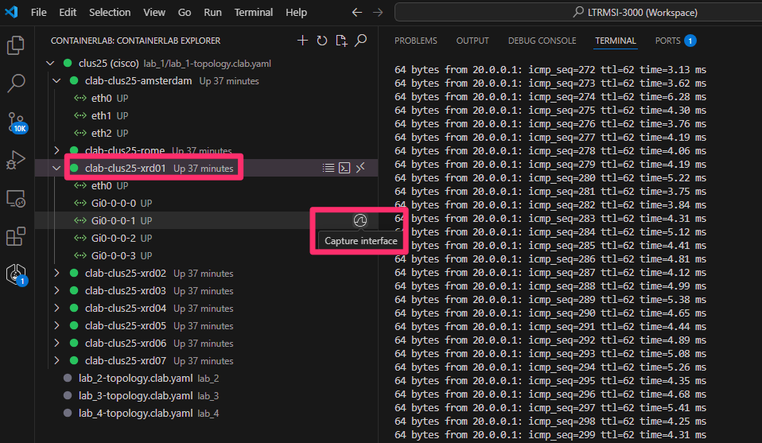
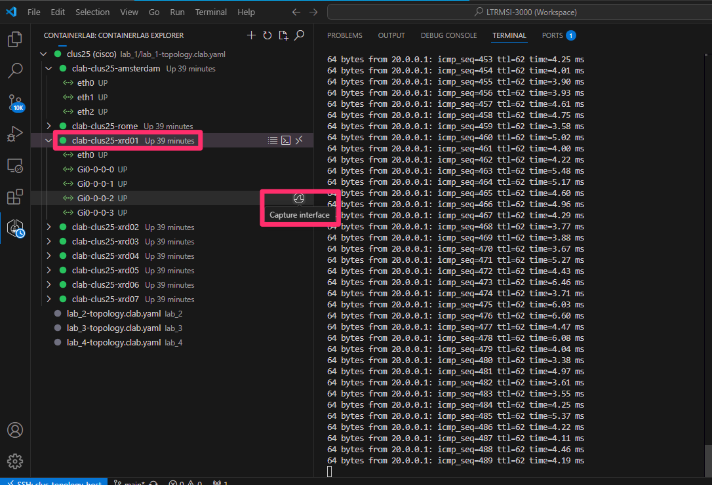
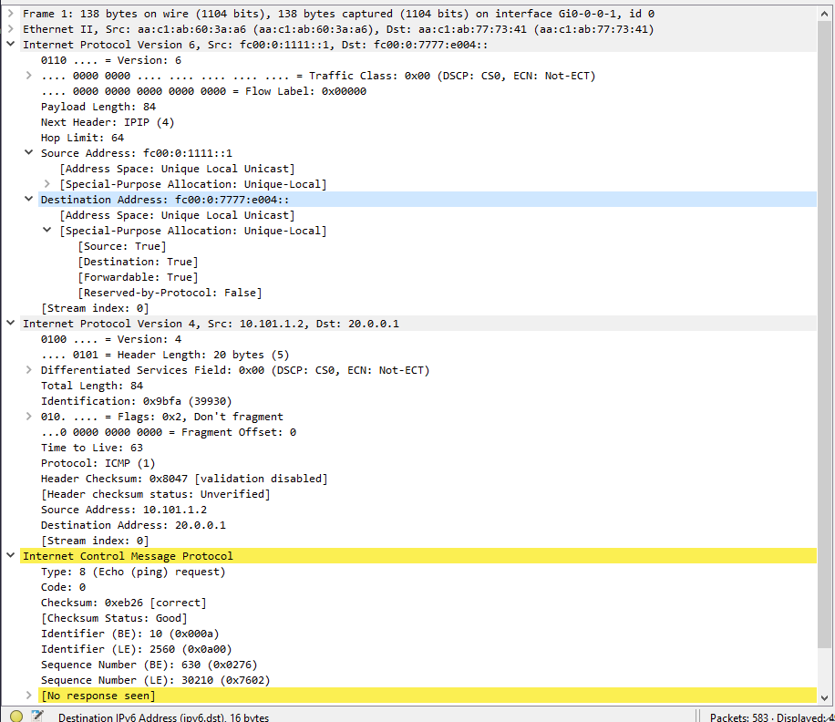
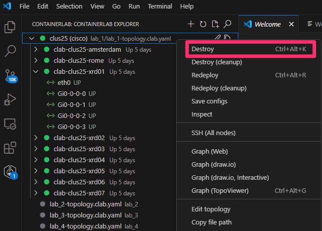

# Lab 1: SRv6 uSID Packet Walk [5 Min]

### Description: 
This is a supplemental lab guide used to deconstruct the forwarding process of traffic through the SRv6 lab topology in this lab. In Lab 1 we established the SRv6 underlay and enabled SRv6 encapsulation of IPv4 traffic in the global forwarding table or default VRF. This is distinct from Lab 2 where we will add the virtualization concept of L3VPN + SRv6.

## Contents
- [Lab 1: SRv6 uSID Packet Walk \[5 Min\]](#lab-1-srv6-usid-packet-walk-5-min)
    - [Description:](#description)
  - [Contents](#contents)
  - [Lab Objectives](#lab-objectives)
  - [Packet Walk Results for traffic from Amsterdam to Rome over SRv6](#packet-walk-results-for-traffic-from-amsterdam-to-rome-over-srv6)
    - [SRv6 Encapsulation and BGP](#srv6-encapsulation-and-bgp)
  - [End of Lab 1 - Packet Walk](#end-of-lab-1---packet-walk)
  

## Lab Objectives
The student upon completion of Lab 1 should have achieved the following objectives:

* Understand how standard IPv4 or IPv6 packets are encapsulated with SRv6 headers
* Understand the forwarding behavior of SRv6 enabled routers
* Understand how SRv6 routers decapsulate and forward traffic as an IPv4 or IPv6 packet
* Understand how IPv6 only routers can participate in SRv6 networks.

## Packet Walk Results for traffic from Amsterdam to Rome over SRv6

The expected results of a packet capture on **xrd01** is to see ICMP IPv4 traffic sourced from **Amsterdam (10.101.2.1)** to a loopback interface on **Rome (20.0.0.1)** use SRv6 encapsulation across the network.

See results below and notice both the ICMP echo and ICMP echo reply packets with SRv6 encapsulation. 
> [!NOTE]
>  In this example the egress and return traffic both happened to be hashed through **xrd02**.
>  Path selection using the global routing table as you will see in the detailed packet walk below
>  has multiple ECMP path options.


Log into the Amsterdam container and start a continous ping to the Rome Container.


   ```
   # ping 20.0.0.1 -i .5
PING 20.0.0.1 (20.0.0.1) 56(84) bytes of data.
64 bytes from 20.0.0.1: icmp_seq=1 ttl=62 time=4.83 ms
64 bytes from 20.0.0.1: icmp_seq=2 ttl=62 time=3.81 ms
64 bytes from 20.0.0.1: icmp_seq=3 ttl=62 time=4.92 ms
64 bytes from 20.0.0.1: icmp_seq=4 ttl=62 time=4.67 ms
64 bytes from 20.0.0.1: icmp_seq=5 ttl=62 time=4.66 ms
64 bytes from 20.0.0.1: icmp_seq=6 ttl=62 time=4.72 ms
64 bytes from 20.0.0.1: icmp_seq=7 ttl=62 time=5.75 ms
64 bytes from 20.0.0.1: icmp_seq=8 ttl=62 time=4.89 ms
64 bytes from 20.0.0.1: icmp_seq=9 ttl=62 time=4.57 ms
64 bytes from 20.0.0.1: icmp_seq=10 ttl=62 time=5.51 ms
   ```

Then we want to capture the traffic using edgeshark to see the SRv6 encapsulated traffic egressing **xrd01**  We don't know which interface the traffic will be hashed through so we may need to capture on both G0/0/0/1 and G0/0/0/2 interfaces:


and 




By filtering only on ICMP packets, we should be able to see the traffic that is interesting to us.


if you expand one of the ICMP request packets, you will see the following :

  

We can see here that we have an IPv6 outer header with an embedeed IPv4/ICMP packet:
   - IPv6 Source is: fc00:0:1111::1 : This is the ingress SRv6 node that inserted the outer header
   - IPv6 Destination is: fc00:0:7777:e004: This is a Segment Identifier (SID) that encodes a specific function or destination. => In our case:  End.DT4 Endpoint with decapsulation and IPv4 table lookup IPv4 L3VPN use (equivalent of a per-VRF VPN label) (For more information: https://www.segment-routing.net/images/201901-SRv6.pdf)
   - Next IP Header: 4 (IPIP)
   - IPv4 Source is: 10.101.1.2 Which is the IP Address configured on the Amsterdam Eth1 interface.
   - IPv4 Destination is: 20.0.0.1, which is the IP Address configured on the Rome container as a loopback inteface.


> [!NOTE]
> If you prefer to inspect the traffic using the cli you can connect to the topology host and type the following commands:
> 
>   ```
>   sudo ip netns exec clab-clus25-xrd01 tcpdump -lni Gi0-0-0-1
>   sudo ip netns exec clab-clus25-xrd01 tcpdump -lni Gi0-0-0-2
>   ```

>
>   Example output:
>   ```
>   cisco@xrd:~/LTRMSI-3000/lab_2$ sudo ip netns exec clab-clus25-xrd01 tcpdump -lni Gi0-0-0-1
>   tcpdump: verbose output suppressed, use -v or -vv for full protocol decode
>   listening on Gi0-0-0-1, link-type EN10MB (Ethernet), capture size 262144 bytes
>   01:54:41.418301 IP6 fc00:0:1111::1 > fc00:0:7777:e005::: IP 10.101.2.1 > 20.0.0.1: ICMP echo request, id 4, seq 11, length
>   01:54:41.421606 IP6 fc00:0:7777::1 > fc00:0:1111:e005::: IP 20.0.0.1 > 10.101.2.1: ICMP echo reply, id 4, seq 11, length 64
>   01:54:41.818159 IP6 fc00:0:1111::1 > fc00:0:7777:e005::: IP 10.101.2.1 > 20.0.0.1: ICMP echo request, id 4, seq 12, length 64
>   01:54:41.821777 IP6 fc00:0:7777::1 > fc00:0:1111:e005::: IP 20.0.0.1 > 10.101.2.1: ICMP echo reply, id 4, seq 12, length 64
>   ```


To see the encapsulated traffic further in the network, feel free to capture traffic using the visual code extension as previously shown. Or you can tcpdump links on **xrd02**, **xrd05**, etc. Examples:
   ```
   sudo ip netns exec clab-clus25-xrd02 tcpdump -lni Gi0-0-0-1
   sudo ip netns exec clab-clus25-xrd05 tcpdump -lni Gi0-0-0-1
   sudo ip netns exec clab-clus25-xrd03 tcpdump -lni Gi0-0-0-1
   sudo ip netns exec clab-clus25-xrd04 tcpdump -lni Gi0-0-0-1
   etc.
   ```


### SRv6 Encapsulation and BGP

In the above **xrd01** recieves IPv4 packets from Amsterdam destined to Rome. We will walk through the process of determining that SRv6 encapsulation is required and lookup process.

1. From **xrd01** we can see a lookup of the IPv4 DA address in the bgpv4 global routing table and the SRv6 SID associated with the route 20.0.0.0/24.
   ```
   show ip bgp ipv4 unicast 20.0.0.0/24
   ```

   Example truncated output:
   ```diff
   RP/0/RP0/CPU0:xrd01#show bgp ipv4 unicast 20.0.0.0/24
   Wed Jan 15 07:05:49.623 UTC
   BGP routing table entry for 20.0.0.0/24

   Paths: (2 available, best #1)
       Not advertised to any peer
       Path #1: Received by speaker 0
       Not advertised to any peer
       Local
       10.0.0.7 (metric 3) from 10.0.0.5 (10.0.0.7)
           Origin IGP, metric 0, localpref 100, valid, internal, best, group-best
           Received Path ID 0, Local Path ID 1, version 17
           Originator: 10.0.0.7, Cluster list: 10.0.0.5
           PSID-Type:L3, SubTLV Count:1
           SubTLV:
   +       T:1(Sid information), Sid:fc00:0:7777:e005::, Behavior:63, SS-TLV Count:1    <---- SRv6 SID encapsulation
          SubSubTLV:
            T:1(Sid structure):
   ```

2. Lookup of fc00:0:7777:e005::/48 the in the global IPv6 routing table.
   ```
   show route ipv6 fc00:0:7777:e005::
   ```

   Output:
   ```
   Routing entry for fc00:0:7777::/48
   Known via "isis 100", distance 115, metric 4, SRv6-locator, type level-2
    Installed Jan 15 05:30:17.646 for 01:37:54
   Routing Descriptor Blocks
      fe80::a8c1:abff:fed7:f84f, from fc00:0:7777::1, via GigabitEthernet0/0/0/1, Protected, ECMP-Backup (Local-LFA)
        Route metric is 4
      fe80::a8c1:abff:fe0b:d167, from fc00:0:7777::1, via GigabitEthernet0/0/0/2, Protected, ECMP-Backup (Local-LFA)
        Route metric is 4
    No advertising protos.
   ```

3. Lets now lookup in the CEF table to see the forwarding next hop.
   ```
   show ip cef 20.0.0.0/24
   ```

   Output:
   ```diff
   20.0.0.0/24, version 55, SRv6 Headend, internal 0x5000001 0x40 (ptr 0x873d5f38) [1], 0x0 (0x0), 0x0 (0x9423a3b0)
     Updated Jan 15 05:32:20.825
     Prefix Len 24, traffic index 0, precedence n/a, priority 4
      gateway array (0x9bc9d098) reference count 1, flags 0x2010, source rib (7), 0 backups
                   [1 type 3 flags 0x48441 (0x88577930) ext 0x0 (0x0)]
     LW-LDI[type=0, refc=0, ptr=0x0, sh-ldi=0x0]
     gateway array update type-time 1 Jan 15 05:32:17.285
   LDI Update time Jan 15 05:32:17.293

    Level 1 - Load distribution: 0
    [0] via fc00:0:7777::/128, recursive

    via fc00:0:7777::/128, 3 dependencies, recursive [flags 0x6000]
      path-idx 0 NHID 0x0 [0x87418200 0x0]
      next hop VRF - 'default', table - 0xe0800000
      next hop fc00:0:7777::/128 via fc00:0:7777::/48
      SRv6 H.Encaps.Red SID-list {fc00:0:7777:e005::}

    Hash  OK  Interface                 Address
   + 0     Y   GigabitEthernet0/0/0/1    fe80::42:c0ff:fea8:c003 <--- ECMP Next-hop
   + 1     Y   GigabitEthernet0/0/0/2    fe80::42:c0ff:fea8:d003 <--- ECMP Next-hop
   + 2     Y   GigabitEthernet0/0/0/1    fe80::42:c0ff:fea8:c003 <--- ECMP Next-hop
   + 3     Y   GigabitEthernet0/0/0/2    fe80::42:c0ff:fea8:d003 <--- ECMP Next-hop
   ```


## End of Lab 1 - Packet Walk

Lab 1 is completed, we need to destroy the topology on containerlab 

In the containerlab tab, right click under clus25 lab 1 and choose destroy.




Please proceed to [Lab 2](https://github.com/cisco-asp-web/LTRMSI-3000/blob/main/lab_2/lab_2-guide.md)