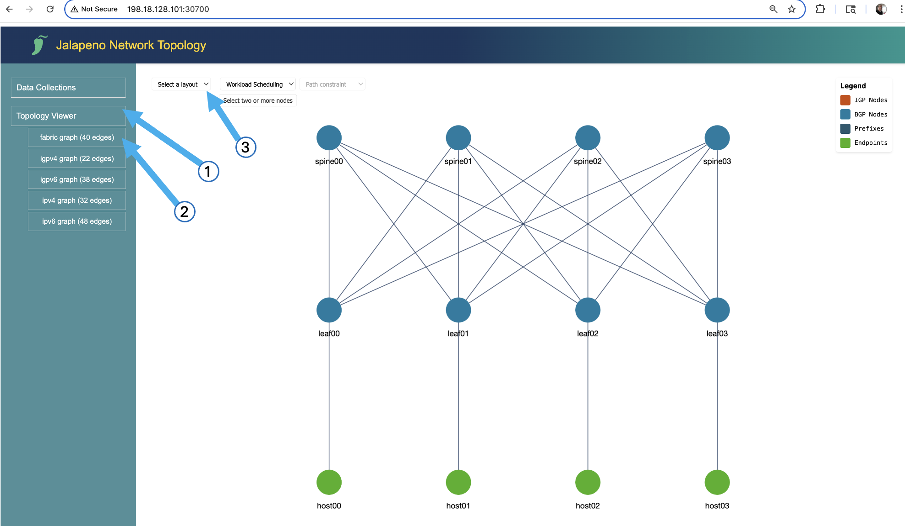

# Lab 5: SRv6 for Intelligent Load Balancing of AI Workloads [20 Min]

### Description
In recent months a few Hyperscalers have expressed interest in running SRv6 over their AI training fabrics. The idea would be to offer their customers the ability to do intelligent and deterministic load balancing of large, long-lived flows, by pinning them to specific paths thru the fabric. The SRv6 encapsulation would happen right at the host stack or RDMA NIC: *`host-based SRv6`*.

In Lab 5 we will explore this use case with our SONiC nodes and their attached Ubuntu containers simulating an AI Training infrastructure. 


## Contents
- [Lab 5: SRv6 for Intelligent Load Balancing of AI Workloads \[20 Min\]](#lab-5-srv6-for-intelligent-load-balancing-of-ai-workloads-20-min)
    - [Description](#description)
  - [Contents](#contents)
  - [Lab Objectives](#lab-objectives)
  - [Host-Based SRv6 for Intelligent Fabric Load Balancing](#host-based-srv6-for-intelligent-fabric-load-balancing)
    - [SRv6 Linux Kernel Routes](#srv6-linux-kernel-routes)
      - [Adding Linux SRv6 Routes](#adding-linux-srv6-routes)
    - [Jalapeno and Modeling Networks as Graphs](#jalapeno-and-modeling-networks-as-graphs)
    - [SRv6 PyTorch Plugin](#srv6-pytorch-plugin)
    - [Linux SRv6 test route](#linux-srv6-test-route)
  - [PyTorch SRv6 Plugin: Network-Optimized Distributed Training](#pytorch-srv6-plugin-network-optimized-distributed-training)
      - [Ping tests and Edgshark](#ping-tests-and-edgshark)
    - [Test flows with TRex tool](#test-flows-with-trex-tool)
      - [Grafana Dashboard](#grafana-dashboard)


## Lab Objectives
The student should have achieved the following objectives upon completion of Lab 5:

* Understand the SRv6 Fabric Load Balancing use case
* Familiarity of the SRv6 stack available in Linux
* Understanding of SONiC's SRv6 uSID shift-and-forward capabilities
* Familiarity with the idea of exposing SRv6 steering services to AI training frameworks and schedulers
* Bonus if time allows: familiarity with the open-source Jalapeno project, its API, and UI

## Host-Based SRv6 for Intelligent Fabric Load Balancing

Recently at the EMEA OCP summit Guohan Lu from Microsoft explained how they build Source Routed AI Backend Networks with SRv6:

https://www.segment-routing.net/conferences/2025-ocp-emea-microsoft-srv6-ai-backend/

The key problem to solve:

 - ECMP of large, long-lived flows can result in path collision or hotspots in the fabric. 
 - With AI training this can lead to delays or even job failures. 
 - Given the cost of running large GPU pools, delay or failure becomes very costly.

The solution: coordination of all senders source routing their traffic over disjoint paths through the fabric.

Cisco doesn't currently have a host-based SRv6 controller product and the Hyperscalers build their own SDN control infrastructure, so to simulate this capability in the lab we've built a *`demo PyTorch SRv6 plugin`* which programs Linux kernel (or VPP) SRv6 routes, and which leverages the open-source *`project Jalapeno`* as its backend data repository.

 - SRv6 PyTorch plugin: https://github.com/segmentrouting/srv6-pytorch-plugin

 - PyTorch Homepage: https://pytorch.org/

 - SRv6 Linux Kernel Implementation: https://segment-routing.org/

 - Project Jalapeno Homepage: https://github.com/cisco-open/jalapeno

*`Insert diagram with PyTorch plugin + Jalapeno controller/API interaction`*


### SRv6 Linux Kernel Routes
   
SRv6 has been available in the mainstream Linux kernel since version 4.10, and the Ubuntu 22.04 nodes in our lab are running Kernel 6.8, so there is no need to install packages or tune any sysctl or other parameters.

Example *docker exec command* to show the kernel version:

```
$ docker exec -it clab-sonic-host01 uname -a

Linux host01 6.8.0-48-lowlatency #48.3~22.04.1-Ubuntu SMP PREEMPT_DYNAMIC Thu Oct 17 14:07:24 UTC x86_64 x86_64 x86_64 GNU/Linux
```

#### Adding Linux SRv6 Routes

Currently the Linux Kernel implementation supports SRv6 SRH encapsulation, but does not yet support uSID. We can work with this because our SONiC nodes do support uSID and we'll simply construct the Linux SRv6 route with a single *segment* in the SRH that happens to have our fabric uSIDs embedded in it.

1. Manually add a Linux SRv6 route on *`host00`* to *`host02`* to take the path *`leaf00`* -> *`spine03`* -> *`leaf02`*: 

  Option 1: exec into *`host00`* and run the ip route add command:
  ```
  docker exec -it clab-sonic-host00 bash
  ip -6 route add 2001:db8:1002::/64 encap seg6 mode encap segs fc00:0:1200:1003:1202:fe06:: dev eth1
  ```

  Option 2: execute the *route add* from the *topology-host* with *docker exec*:

  ```
  docker exec -it clab-sonic-host00 ip -6 route add 2001:db8:1002::/64 encap seg6 mode encap segs fc00:0:1200:1003:1202:fe06:: dev eth1
  ```

2. Display the Linux route on *host00*:
   ```
   docker exec -it clab-sonic-host00 ip -6 route show 2001:db8:1002::/64
   ```

   Expected output:
   ```
   $ docker exec -it clab-sonic-host00 ip -6 route show 2001:db8:1002::/64
   2001:db8:1002::/64  encap seg6 mode encap segs 1 [ fc00:0:1200:1003:1202:fe06:: ] dev eth1 metric 1024 pref medium
   ```

The SRv6 uSID combination in the above will route traffic to *host02* via *`leaf00`*, *`spine03`*, and then *`leaf02`*. uSID shift-and-forward at *leaf00* and *spine03* will result in an ipv6 destination address of **fc00:0:1202:fe06::** when the packet arrives at *leaf02*.  *leaf02* recognizes itself and its local uDT6 entry *`fc06`* in the destination address and will proceed to pop the outer IPv6 header and do a lookup on the inner destination address **2001:db8:1002::/64** and forward the traffic to *`host02`*

3. Connect to SONiC *`leaf02`*, invoke FRR vtysh and 'show run' to see the SRv6 local SID entries:
  ```
  ssh admin@clab-sonic-leaf02
  ```
  ```
  vtysh
  show run
  ```

  Partial output:
  ```
  segment-routing
  srv6
   static-sids
    sid fc00:0:1202::/48 locator MAIN behavior uN
    sid fc00:0:1202:fe04::/64 locator MAIN behavior uDT4 vrf default
    sid fc00:0:1202:fe06::/64 locator MAIN behavior uDT6 vrf default
  exit
  ```

4. Run a ping from *host00* to *host02*
   ```
   docker exec -it clab-sonic-host00 ping 2001:db8:1002::2
   ```

5. Optional: while the ping is running perform Wireshark capture(s) to see the encapsulated packets and shift-and-forward in action. Recommended interfaces for Wireshark capture:

 - clab-sonic-host00 eth1
 - clab-sonic-spine03 eth1
   
The example packet capture below is taken from *spine03* eth1. As you can see the outer IPv6 destination address has been shifted-and-forwarded by *leaf00*. We don't need to worry about the Linux SRH because when it arrives at *leaf02* that node will see its local uDT6 entry *fc00:0:1202:fe06* and decapsulate the entire thing, and forward the inner packet to *host02*


### Jalapeno and Modeling Networks as Graphs

We've created a model of our SONiC fabric topology with relevant SRv6 data in Jalapeno's Arango Graph Database. This makes the fabric topology graph available to PyTorch (or other SDN applications) via Jalapeno's API. 



After completing **Lab 5** feel free to checkout the [Lab 5 Bonus Section](./lab_5-bonus.md) that explores the Jalapeno GraphDB, API, UI, and other host-based SRv6 scenarios in more detail.

### SRv6 PyTorch Plugin

From https://pytorch.org/projects/pytorch/

*PyTorch is an open source machine learning framework that accelerates the path from research prototyping to production deployment. Built to offer maximum flexibility and speed...its Pythonic design and deep integration with native Python tools make it an accessible and powerful platform for building and training deep learning models at scale.*

**PyTorch Distributed Training:**

When you start distributed training, PyTorch initializes a process group. It uses a backend (like NCCL or Gloo) for communication between nodes. Each node gets a rank and knows about other nodes through the process group

**pytorch-srv6-plugin's Workflow:**

Before NCCL/Gloo starts communicating, the plugin will:

  - Get the list of nodes from the distributed workload setup
  - Query the Jalapeno API for a shortest-path (lowest *`load`* metric) for each *source/destination* pair
  - The API returns an SRv6 uSID encapsulation instruction for each *source/destination* pair that will pin traffic to a specific path in the fabric
  - The *plugin* then programs local linux SRv6 routes on each node. 

> [!Note]
> If we had GPUs and RDMA NICs we would work to extend the plugin to program route + SRv6 encap entries on the NIC itself


  - The distributed workload's traffic is SRv6 encapsulated as it egresses the source *host*

Here's a typical flow:

```
[PyTorch Training Script]
        ↓
[Initialize Distributed Training]
        ↓
[PyTorch calls NCCL backend]
        ↓
[SRv6 Plugin intercepts]
        ↓
[Programs SRv6 routes]
        ↓
[NCCL uses routes for communication]
        ↓
[Training continues normally]
```

The key point is that the plugin works at the network layer, below both PyTorch and NCCL. It ensures that when NCCL needs to communicate between nodes, it uses the optimized SRv6 paths we've programmed, but NCCL itself doesn't need to know about SRv6 - it just sees the network as being faster and more efficient.

The demo uses gloo as the backend instead of NCCL because:
gloo is a CPU-based backend that doesn't require GPUs
It's perfect for testing and demonstration purposes
It still provides all the distributed training functionality we need

The interaction is similar, but simpler:

```
[PyTorch Training Script]
        ↓
[Initialize Distributed Training with gloo backend]
        ↓
[SRv6 Plugin intercepts]
        ↓
[Programs SRv6 routes]
        ↓
[gloo uses routes for communication]
        ↓
[Training continues normally]
```

The key:
The plugin intercepts the distributed initialization phase
It programs the SRv6 routes before any communication starts
It doesn't care which backend is being used for the actual communication

### Linux SRv6 test route

The linux route entries include SRv6 encapsulation instructions per the Linux kernel SRv6 implementation. For more info: https://segment-routing.org/


## PyTorch SRv6 Plugin: Network-Optimized Distributed Training

The PyTorch SRv6 Plugin is a tool that leverages SRv6 to enhance distributed training. It optimizes network paths for distributed training workloads by dynamically programming SRv6 routes based on real-time network conditions.

Key Features

* Network-Aware Distributed Training: Automatically optimizes network paths for PyTorch distributed training sessions
* SRv6 Route Programming: Programs optimal SRv6 routes using either Linux kernel or VPP (Vector Packet Processing)
* Dynamic Path Selection: Uses Jalapeno API to determine the best network paths based on current network conditions
* Multi-Platform Support: Works with both Linux and VPP platforms for route programming
* Distributed Training Integration: Seamlessly integrates with PyTorch's distributed training framework

How It Works
Initialization: When a distributed training session starts, the plugin:
Initializes the distributed environment
Collects information about all participating nodes
Establishes communication with the Jalapeno API
Path Discovery: For each node pair:
Queries the Jalapeno API for optimal paths
Receives SRv6 path information including USIDs (Universal Segment Identifiers)
Processes path information to determine optimal routes
Route Programming: For each discovered path:
Programs local SRv6 routes using the appropriate platform (Linux/VPP)
Appends destination functions to USIDs
Sets up encapsulation for optimal packet forwarding
Distributed Training: After route programming:
Enables distributed training communication
Maintains optimized network paths throughout the training session
Ensures efficient data transfer between nodes
Use Cases
Distributed Deep Learning: Optimize network paths for multi-node training
Network-Aware Computing: Leverage SRv6 for intelligent packet routing
High-Performance Computing: Improve communication efficiency in distributed systems
Network Engineering Training: Demonstrate SRv6 capabilities in a practical setting
Technical Requirements
Python 3.8+
PyTorch
Linux kernel with SRv6 support (for Linux route programming)
VPP (optional, for VPP-based route programming)
Access to Jalapeno API
Network infrastructure supporting SRv6
This plugin serves as an excellent example of how modern networking technologies like SRv6 can be integrated with distributed computing frameworks to optimize performance and resource utilization.

#### Ping tests and Edgshark

### Test flows with TRex tool

#### Grafana Dashboard


